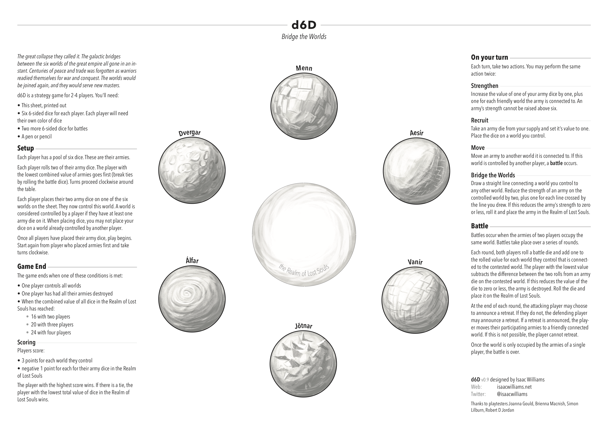

Here's one from the vault. **d6D: Bridge the Worlds** is a print-and-play [4X](https://en.wikipedia.org/wiki/4X) strategy game for 2-4 players, designed for a Ludum Dare competition in 2014. The game is played with just the print-out provided, a pencil and a set of six d6s for each player.

It's part Risk, part crayon rail. The aim is to conquer the six worlds. To do this, you draw bridges between the worlds that will strengthen your own position, let you attack other players, or make it harder for them to attack you.

Your d6s represent your armies — the higher the number, the stronger it is. Once you've built up your forces and conquered a couple of nearby worlds, you'll need to fight your opponents for control of the rest. When an army perishes, it is sent to the _realm of lost souls_... and once the _realm_ overflows with the damned, the game is over (or all of the worlds are conquered). The victor is the player who controls the most worlds, and managed to lose the fewest armies in the process.

[Download a PDF here](./d6D-sheet-0.9.pdf).

