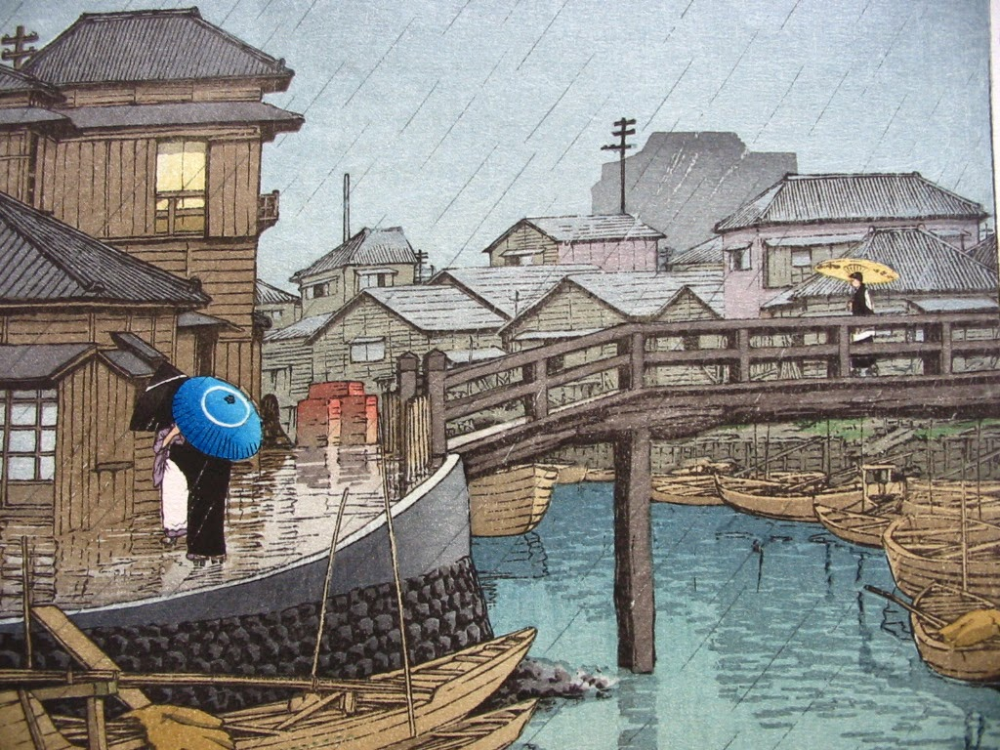

    Hasui Kawase</a>" />

The Gloaming Lands are a wild place, a place deeply etched with disaster. The peoples that populate it keep to the safety of their settlements. Most people will never travel further than the next two or three villages along. Wanderers are looked upon with distrust.

Like the table of animals, this generator is designed to create interesting, gameable situations with a minimum of reading.

  

<table-roller table="settlements,sizes,names" buttons='[["What is this place?", {
    "Name": "Structure",
    "Size": "2d6:lowest:Size",
    "Environs": "d20:Environs",
    "People": "d20:People",
    "Notable building": "d20:Building",
    "Primary industry": "d20:Industry",
    "Event": "d20:Event"
}], ["Just a name", {
    "~~resultType": "append",
    "Name": "Structure"
}]]'></table-roller>

## 5d20 Settlements

| d20 | Environs | People | Building | Industry | Event |
|-----|----------|--------|----------|----------|-------|
| 1 | In the ruins of an ancient temple | Extremely suspicious of outsiders | Imposing defensive walls | Fields of maize, yellow in the sun | A grand wedding |
| 2 | In the ruins of an ancient castle | Often intoxicated by strange mushrooms | Unmaintained wooden palisades | Rows of cabbage | Festival for the local god |
| 3 | Amongst the bones of a great beast | Fervent followers of their strange god | Ancient castle | Shallow ponds of green rice | Meeting of elders from afar |
| 4 | Atop a hill | Known for their strange delicacies | Wood and stone manor house with a high peaked roofs | Windmill for grinding maize | A building is on fire |
| 5 | At the banks of burbling stream | Have laws or customs confusing to outsiders | Comfortable, well-appointed inn | Wood mill | A god walks amongst the people |
| 6 | In a protected valley | Refuse to do business with outsiders | Shrine, of ornately carved and polished black oak | Bustling market | Children have been going missing |
| 7 | A pond, covered in lilies and the persistent croaking of frogs | Practice strange rituals under the cover of darkness | Shrine, newly constructed of stone | Staging area for cave-scavengers | An illness has struck |
| 8 | A gnarled tree, older than anything around | Cover themselves in odd tattoos | Shrine, recently burned to the ground | Renowned school | Under attack from bandits |
| 9 | Cleared for industry or agriculture | Brew delicious, potent maize wine | Shrine constructed of scavenged shards of metal | Quarry for marble or quartz | A plague of insects has ruined the harvest |
| 10 | Animals wander the streets, searching for food | Wear long hoods that cover their faces | Shine carved into the stone of a cave | Mine for copper, tin or iron | Strange creatures have raided the storehouse |
| 11 | A long-forgotten tunnel system links the basements | Wear large, wide-brimmed hats | A mess of closely-packed shanties | Deep mine for gold or silver, maybe abandoned | The folk are in the midst of a cutthroat factional struggle |
| 12 | Amongst tall, wind-eroded towers of stone | Wear brightly-dyed woollen garments | Meditative garden, carefully maintained | Alchemical lab, spewing strange-coloured smoke | A funeral procession, the streets thick with ceremonial smoke |
| 13 | Built into caves or the walls of a cliff | Are very curious about news from afar | Huge abandoned machine, it's interior stripped of parts | Traps for eels in a nearby creek | Market day, farmers from throughout the area flock to town |
| 14 | Overgrown with rare flowers | All descended from a single matriarch | Ornate wooden bridge, guarded by statues | Glassblower's workshop | Local baron holding a recruitment drive for their milita |
| 15 | Amongst giant, moss-covered boulders | Believe cutting their hair is bad luck | Ancient bridge of concrete and steel, reinforced with wood | Workshop for fine wooden crafts | A public execution is taking place |
| 16 | Nearby animals are strangely intelligent | Keep regimented hours of work and prayer | Shell or skull of a massive beast | Wool mill, draped in brightly-dyed cutoffs | A public trial is taking place |
| 17 | On a baronial border - half the folk pledge loyalty to another baron | Wear finely-embroidered clothes | Grand hall built on stilts over a lake | Silk mill and tailor of fine clothes | A flying machine slowly drifts far above the clouds |
| 18 | Between high white karst hills, bursting out of the forest | Make pungent cheese, cured for years | Unnervingly tall and twisted wooden tower | Tannery, stinking of blood and piss | A wizard's walking tower has planted itself nearby |
| 19 | On the banks of a wide, slow river | Are mostly children | Strong, squat tower of stone | Kiln for lacquered porcelain | Seasonal festival, shirtless revelers and drunkenness |
| 20 | Atop the ruins of an ancient factory | Are mostly elders | Repurposed tower of glass and steel, built by the ancients | Wizard's tower, travelers coming to seek help | Baronial levy is called, tax collectors stalk the streets |

### Settlement size

Roll 2d6 and take the lowest value.

| d6  | Size    
|-----|---------------
| 1   | Farm/manor – 1-3 families
| 2   | Crossroads – 3-4 families
| 3   | Hamlet – 50-150 people
| 4   | Village – 150-300 people
| 5   | Town – 300-1000 people
| 6   | City – 1000+ people

### Settlement names

| d20 | Structure                         | History A  | History B | Thing A | Thing B   | Place A   | Place B |
|-----|-----------------------------------|------------|-----------|---------|-----------|-----------|---------|
| 1   | {Thing A} {Place A}               | New        | North     | Tree    | Ox        | River     | Falls   |
| 2   | {Thing A} {Place B}               | Old        | East      | Oak     | Eagle     | Pond      | Heights |
| 3   | {Thing B} {Place A}               | Broken     | South     | Jasmine | Crab      | Lake      | Ruins   |
| 4   | {Thing B} {Place B}               | Gallows    | West      | Jade    | Eel       | Beach     | Keep    |
| 5   | {History A} {Place A}             | Shield     | Upper     | Rice    | Carp      | Spring    | House   |
| 6   | {History A} {Place B}             | Bloody     | Lower     | Rose    | Ape       | Mountain  | Manor   |
| 7   | {History B} {Place A}             | Hidden     | Dragon    | Arrow   | Monkey    | Hill      | Well    |
| 8   | {History B} {Place B}             | White      | Ogre      | Petal   | Skull     | Creek     | Hole    |
| 9   | {History A} {Thing A}             | Blue       | Lord's    | Pine    | Forge     | Swamp     | Trail   |
| 10  | {History B} {Thing B}             | Yellow     | Ghostly   | Maple   | Sword     | Boulder   | Baths   |
| 11  | {Place A} {Place B}               | Green      | Hell's    | Blossom | Horseshoe | Field     | Woods   |
| 12  | {History A} {History B}           | Banner     | Heavenly  | Cherry  | Anvil     | Peninsula | Forest  |
| 13  | {Thing A} {Thing B} {Place A}     | Typhoon    | Midsummer | Crab    | Witch     | Bridge    | Copse   |
| 14  | {Thing B} {Thing A} {Place B}     | Friendship | Solstice  | Stone   | Wizard    | Farm      | Stand   |
| 15  | {History A} {Thing B} {Place B}   | Sunset     | All-gods  | Cloud   | Willow    | Tower     | Village |
| 16  | {History A} {Thing A} {Place A}   | Dawn       | Harvest   | Iron    | Machine   | Road      | Cliff   |
| 17  | {History B} {Thing B} {Place A}   | Ancient    | Wailing   | Gold    | Mineral   | Bluff     | Cave    |
| 18  | {History A} {History B} {Place A} | Lost       | Wailing   | Glass   | Copper    | Harbor    | Gate    |
| 19  | {History A} {Place A} {Place B}   | Wounded    | Glowing   | Tea     | Hoard     | Rock      | Bell    |
| 20  | {History B} {Place B} {Place A}   | Singing    | Winding   | Crystal | Amber     | Castle    | Works   |
