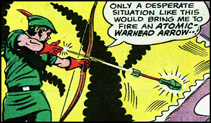

These are special arrows — minor magical or mechanical items that give bow-wielding characters a tactical edge. They are written with Knave in mind, but should work for the OSR game of your choice.

Special arrows do the same damage as the bow they are fired from, plus any additional effects. Unless it seems really obvious that it should be otherwise, assume that each is arrow is only good for a single successful hit. Each missed special arrow shot has a 50% chance of being recoverable, except in the case of arrows like the Bomb Arrow, which explodes.

Three special arrows can fit in an inventory slot.

**Tying arrows together to get multiple effects**: totally works and is encouraged. Only roll for weapon damage once, but apply all additional damage/effects from the bundled arrows.

### Table of d100 Arrows

Arrows 1-10 are fairly common, and can sometimes be found in stores. Arrows 11+ are rare, and can only be found by adventuring.

<table-roller table="arrows" filter="d100" buttons='[["Common arrow", "d10"],["Rare arrow", "d100"]]'></table-roller>

d100 | Type | Effect
----|------|----------------------------------------------
1 |  Fire arrow | Lights things on fire. 1d6 additional fire damage per round until an action is taken to put it out.
2 |  Ice arrow | Does 1d6 ice damage. Target must save or become frozen for 1d10 rounds. While frozen they have disadvantage on all saves that require quick movement.
3 |  Smoke arrow | Fills a 20' cube with thick smoke that almost completely blocks sight
4 |  Rope arrow | Spins out up to 50' of rope behind itself. The rope lasts for 10 minutes before crumbing into dust.
5 |  Flare arrow | Produces a blindingly bright light and a trail of red smoke.
6 |  Marking arrow | If you hit with this arrow, all further attacks against the same target have advantage until the arrow is removed.
7 |  Water arrow | Bursts into a 5' radius sphere of water on hit.
8 |  Moss arrow | Covers the hit location in a 10' radius of soft green moss.
9 |  Bomb arrow | Does an additional 2d6 damage to all within 10' of the target. Save for half.
10 |  Oil arrow | Covers a 5' radius in slippery, flammable oil.
11 |  Electric arrow | Coes an additional 1d6 electric damage, target must save or be stunned for 1d6 rounds.
12 |  Web arrow | Spins out a thin, strong span of web behind it. On impact, covers a 10' area in thick, sticky webs.
13 |  Poison arrow | Does an additional 1d12 poison damage. Save to negate.
14 |  Black arrow | Advantage on to-hit rolls, always does maximum damage.
15 |  Singing arrow | When fired, sings folk songs in a high, clear voice.
16 |  Ghost arrow | Can pass through walls.
17 |  Ricochet arrow | On a miss, roll attack vs nearest other creature. Repeat until a hit.
18 |  Rubber arrow | Does half damage. On a hit, roll attack against nearest other creature. Repeat until miss.
19 |  Invisible arrow | Shimmering and trancelucent. Once fired, disappears completely.
20 |  Friendship arrow | Does no damage. If hit, target makes new reaction roll with +1 bonus.
21 |  Trick arrow | Looks like a regular arrow, explodes for 2d6 damage (save for half) when drawn back in bow.
22 |  Slow arrow | Flies at a walking pace. Still has the same amount of momentum behind it, just moves in slow motion.
23 |  Immovable arrow | Cannot be moved from where it lands.
24 |  Delicious arrow | Target emits an incredibly delicious odor.
25 |  Fear arrow | On a hit, target makes morale test with -1 modifier.
26 |  Magnetic arrow | Sticks to metals, advantage on to-hit rolls vs creatures wearing metal armour.
27 |  Courageous arrow | Glows golden in the dark. On hit, gives advantage to Save vs fear when you can see the target.
28 |  Deadweight arrow | Arrowhead becomes as heavy as a cart when it lands, holding whatever it hits in place.
29 |  Teleport arrow | Archer is teleported to the location where this lands.
30 |  Scrying arrow | With paired scrying glass, archer can see through the arrowhead
31 |  Darkness arrow | Snuffs out all sources of light within 30' for 10 mins.
32 |  Fishing arrow | Always hits its target, if the target is a fish.
33 |  Sleep arrow | Target must save or fall into a deep sleep for 1d6 x 10 mins. Anything less vigorous than a slap will not wake them.  
34 |  Focus arrow | A spell can be cast on this arrow. The spell will be released on hit, with the same target as the arrow.
35 |  Brute arrow |  +1 damage. Roll attack as if it were a melee weapon (using Str bonus).
36 |  Rust arrow | Rusts metals on hit
37 |  Stun arrow | All creatures within 10’ of target must save or be stunned for a round
38 |  Slime arrow | Covers the target and surrounding surface in sticky slime
39 |  Ancient arrow | Target ages 2d20 years
40 |  Self-propelled arrow | Can be thrown with the range of a longbow. If fired from a bow, triple the firing range.
41 |  Portal arrow | Comes in pairs of red and blue. When it hits a solid surface, creates a portal at the location of hit, which leads to the matching portal.
42 |  Polymorph arrow | Turns target into (d6: 1 dog; 2 sheep; 3 chicken; 4 fish; 5 tree; 6 ogre) for 1d4 x 10 mins
43 |  Oaken arrow | When it hits, rapidly grows into a large oak tree
44 |  Rotting arrow | On hit, target must save or the flesh around the hit location rots for 2d6 additional damage
45 |  Itching arrow | Causes incredibly distracting itching sensations. Target must save each round for 1d6 rounds or be too distracted to do anything but scratch.
46 |  Forceful arrow | The target is pushed back 1d6 x 10', and must save or be knocked down.
47 |  Golden arrow | An arrow made of pure gold. Worth 10gp.
48 |  Returning arrow | Can be called back to the the archer by whistling. 1-in-6 chance of breaking on hit or miss.
49 |  Automatic arrow | When notched in a bow, the bow floats in the air and will stay drawn until a trigger word is spoken.
50 |  Rage arrow | Target must save or attack the nearest target for 1d4 rounds.
51 |  Wishing arrow | When fired the archer whisperers a wish for the target of the shot. On a hit, it becomes true for 1d6 rounds, after which reality rapidly snaps back into order.
53 |  Random arrow | When fired, randomly select the target of this arrow from all creatures with range. Always hits the target.
54 |  Wild arrow | On hit, the arrow transforms into a confused but vicious wolf.
55 |  Telltale arrow | If the target of this arrow dies within the next day, all sentient creatures in the surrounding area will know it’s fate & location.
56 |  Winding arrow | Can attack targets around corners or behind cover.
56 |  Soul arrow | If the target of this arrow dies with the arrowhead stuck in them, their soul is trapped inside it.
55 |  Hunting arrow | Always hits its target, if the target is a natural wild animal.
56 |  Infernal arrow | On hit, target must save or become possessed by a random demon.
57 |  Storm arrow | When fired, a wild, violent storm forms in the sky. The arrowhead acts as a lighting rod.
58 |  Healing arrow | Does no damage. Heals weapon damage + 1d6 HP.
59 |  Wounding arrow | Target must save or suffer a grievous wound (bypassing HP).
60 |  Disappearing arrow | Target blinks out of reality for 1d6 rounds.
61 |  Blooming arrow | Bright, fragrant flowers rapidly grow in a 10’ radius around the target.
62 |  Medusa arrow | Target must save or be turned to stone.
63 |  Knocking arrow | If shot into a door, it is magically forced open.
64 |  Liquid arrow | When fired, turns into a liquid which can slide under objects & doors until it hits the target.
65 |  Mutating arrow | Target must save or take a random mutation.
66 |  Binding arrow | Clinging vines burst from the arrowhead, wrapping tightly around the target.
67 |  Boulder arrow | Transforms into a boulder when fired. Target and all within 5’ must make Dex save or take 2d6 damage.
68 |  Rainbow arrow | Leaves a bright rainbow trail behind it. On hit, 1d6 gp burst from the arrowhead, dealing 1 additional damage per gp.
69 |  Witch arrow | Target must save or suffer a random curse.
70 |  Bodyswap arrow | Archer swaps bodies with the target for 1d6 rounds.
71 |  Withering arrow | Target must save or a random limb withers into uselessness.
72 |  Commanding arrow | Target must save or follow a single word command spoken by the archer.
73 |  Unreliable arrow | On hit, flip a coin. On heads, does double damage. On tails, does no damage.
74 |  Elemental arrow | On hit, this arrow gains the effects of (d6: 1 Fire arrow, 2 Ice arrow, 3 Water arrow, 4 Electric arrow, 5 Oaken arrow, 6 Boulder arrow).
75 |  Cupid's arrow | Target must save or fall madly in love with the archer (this does not necessarily mean they are friendly).
76 |  Cartographer's arrow | Always lands facing due north.
77 |  Sundering arrow | Destroys any shield the target is weilding.
78 |  Drunkard arrow | Target becomes incredibly drunk, save for mildly intoxicated.
79 |  Trick-shot arrow | Always hits, as long as the archer is doing a ridiculously showy and dangerous stunt.
80 |  Intelligent arrow | Imbued with the soul of a dead wizard. Can talk. Doesn't want to be fired and risk breaking.
81 |  Last arrow | Always hits and does max damage, but only if it is the archer's last arrow.
82 |  Fratricidal arrow | All damage dealt by this arrow is also dealt the the target's closest family member.
83 |  Double arrow | Instantly loads a copy of itself into the bow after firing (once). Allows two attacks in a turn.
83 |  Deafening arrow | Emits a deafening boom on hit. Creatures within 60' are deafened for 10 mins.
84 |  Artist arrow | On hit, splatters the nearby surfaces with multicoloured paint in pleasing manner.
85 |  Sickening arrow | Target must save or succumb to a random disease.
86 |  Acid arrow | On hit, splashes 5' radius with highly corrosive acid which does 1d4 damage per round. Stops burning after 1d10 rounds.
87 |  Hive arrow | On hit, explodes into a swarm of angry bees. The bees do 1d6 damage to all creatures within 10', until a 6 is rolled.
88 |  Average arrow | Instead of rolling to hit, use 10 as the attack roll result. Instead of rolling for damage, use half the bow's max damage.
89 |  Undead arrow | If this arrow kills the target, it rises from the dead and will follow the archer's orders. The effect lasts 1d6 hours.
90 |  Stubbon arrow | If shot misses, returns to the archer's bow, ready to fire again next round.
91 |  Steppe arrow | Grants advantage on to-hit and damage rolls when shot from horseback.
92 |  Split arrow | When fired, splits into two arrows. Roll attacks and select targets separately.
93 |  Mindreader arrow | While this arrow is stuck in the target, the archer can hear the target's thoughts.
94 |  Diamond arrow | Arrowhead is a large diamond. Worth 50gp.
95 |  Eagle arrow | When fired, the archer transforms into an eagle for 1d6 rounds. The arrow continues it's flight from wherever the eagle is when the effects ends.
96 |  Silent arrow | On hit, all sound within a 30' radius is completely silent for 10 mins.
97 |  Turning arrow | On hit, all undead creatures within 30' radius must save or flee.
98 |  Growing arrow | Target grows to double it's size for 10 mins.
99 |  Shrinking arrow | Target shrinking to half it's size for 10 mins.
100 |  Quantum arrow | When fired, roll on this table again for the effect.
