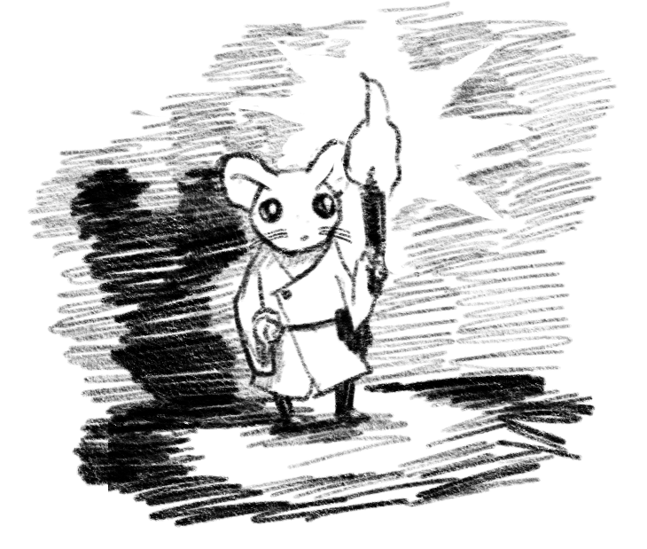

    

I've started working on a game and setting called Mausritter. The player characters are cute mice, who are also classic D&D adventurers. It's a collection of a lot of the D&D ideas I've been collecting for a long time. It'll be packaged into a nice, compact little book, with plenty of random tables to help GMs run mouse-scale adventures.

This is part of the tables from Mausritter — d66 one-line adventure seeds, or 3d66 sometimes-nonsensical adventure seeds.

<table-roller table="adventure-seeds" buttons='[
["Random adventure", {
    "Creature": "Creature",
    "Problem": "Problem",
    "Complication": "Complication"
}],
["Very random adventure", {
    "Creature": "d36:Creature",
    "Problem": "d36:Problem",
    "Complication": "d36:Complication"
}]
]'></table-roller>

|d66|Creature               |Problem                           |Complication                           |
|---|-----------------------|----------------------------------|---------------------------------------|
|11 |Fishermouse            |have been accused of a crime      |a player's hireling is responsible     |
|12 |Unruly family          |looking for a new home            |need to cross a river                  |
|13 |Wizard                 |is being followed                 |antagonist is their own shadow         |
|14 |Roach wrangler         |discovered a strange artefact     |they have amnesia                      |
|15 |Farmer                 |experienced an unsettling omen    |the antagonist is in disguise          |
|16 |Burghermaster          |want to assassinate a rival       |player mouse's home is involved        |
|21 |Forager                |want to retrieve lost treasure    |it is protected by strange beasts      |
|22 |Shopkeeper             |home has been destroyed           |antagonist is their closest friend     |
|23 |Travelling merchant    |most valued possession was stolen |they are the true antagonist           |
|24 |Pigeon rider           |has been kidnapped                |player mouse's friend is involved      |
|25 |Ale brewer             |has been exiled from settlement   |they've been framed                    |
|26 |Herbalist              |searching for a rare cure         |it's very urgent                       |
|31 |Message runner         |have lost their way               |they have vital information            |
|32 |Vagrant                |have had all their food stolen    |the antagonist had a good reason       |
|33 |Test subject           |are on the run from humans        |they're being tracked by a chip        |
|34 |Tin miner              |have been waylaid by bandits      |the antagonist is very drunk           |
|35 |Baker                  |have eaten a poisonous berry      |antagonist is a family member          |
|36 |Hedge knight           |family member is missing          |they're dying                          |
|41 |Tax collector          |have lost of a lot of pips        |they're very drunk                     |
|42 |Matriarch              |has been accused of murder        |antagonist is a shape-shifter          |
|43 |Prospector             |pack tortoise is stuck            |they're much richer than they look     |
|44 |Tunneler's Guild boss  |has been murdered                 |player mouse's rival is involved       |
|45 |Noblemouse             |their home is under attack        |antagonist wants retribution           |
|46 |Rat bandit             |want to steal from a rival        |a ghost is haunting the location       |
|51 |Queen bee              |traveling to a new home           |their followers disagree               |
|52 |Ant army officer       |are hunted by enemies             |they are badly injured                 |
|53 |Owl sorcerer           |want to retrieve a rare spell     |it is deep in a cave                   |
|54 |Cat lord               |want to be entertained            |they've trapped the player mice        |
|55 |Duckling               |has lost their mother             |need to get to an island               |
|56 |Giant millipede        |want somewhere warm to sleep      |need item carried by a player mouse    |
|61 |Lilliputian ambassador |want to reach the mouse king      |they don't understand local customs    |
|62 |Trapped ghost          |want to find their true love      |they can't leave their current location|
|63 |Faerie envoy           |want to kidnap a mouse            |a player mouse is their target         |
|64 |Swarm of midges        |want to steal from a player mouse |antagonist is unusually skilled        |
|65 |Grandmother spider     |has lost an ancient treasure      |they've eaten it                       |
|66 |Baby bird              |cannot get home                   |need to climb a tree                   |
