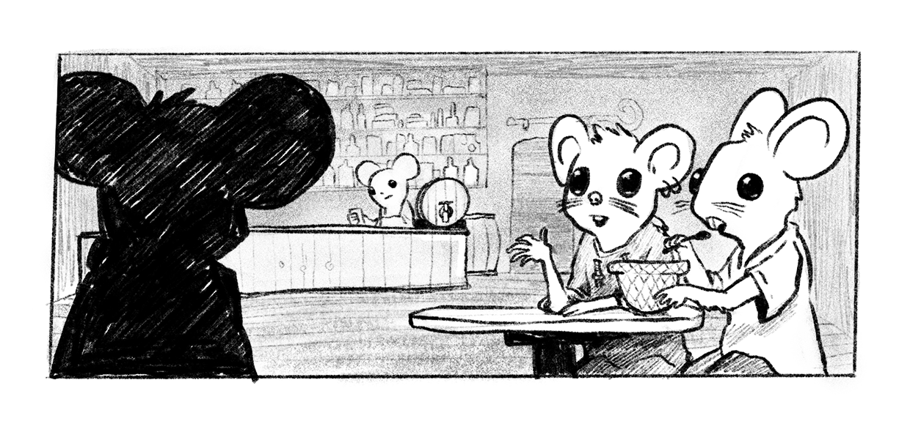

This generator creates the details for the many settlements that dot that mouse kingdoms. It's largely based on the [Gloaming Lands settlement](/2018-12-10-settlements/) generator I wrote a while ago, with thematic mousey tweaks.

The intended use of this generator is in tandem with the Mausritter [location](/2019-07-24-mausritter-locations/) generator. In that case, ignore the result of the "location" field and roll on the an appropriate landmark column to figure out the location of a settlement.

    

<table-roller table="sizes,settlements,names" buttons='[["Random settlement", {
    "Name": "d4:NameFormat",
    "Size": "2d6:lowest:Size",
    "Location": "d20:Location",
    "Inhabitants": "d20:Inhabitants",
    "Notable feature": "d20:Notable feature",
    "Event": "d20:Event"
}]]' data='{
    "NameFormat": ["{Start A}{End A}", "{Start B}{End B}", "{Start A}{End B}", "{Start B}{End A}"],
    "Location": ["Anthill","Beech, lightning split","Bone-white tree","Cow skeleton","Field of flowers","Field of wheat","Hedge row","Hollow tree stump","Huge flat rock","Lily-lined pond","Massive fallen tree","Old craggy oak","Old farmhouse","Quiet dirt road","Rabbit warren","Sparrow nest","Stand of pine trees","Steep hill","Stone wall","Tangle of fig roots","Abandoned shack","Bright clearing","Cascading waterfalls","Cliff face","Cold, fresh spring","Dense underbrush","Face in ancient oak","Fox hole","Grove of ferns","Hollow tree stump","Huge pine tree","Human walking track","Human-made clearing","Meandering brook","Overgrown ruins","Ring of stones","Rocky outcropping","Sunken hollow","Tangle of roots","Termite-riddled tree","Canal lock","Converging tributaries","Draping willow","Eroded riverbank","Fallen tree crossing","High waterfall","Huge boulder","Huge concrete dam","Isolated island","Muddy flats","Rocky rapids","Row of dead trees","Silty dam","Stepping-stones","Stone bridge","Stoney shallows","Submerged trash","Sunken barge","Twisted roots","Wooden bridge","Abandoned car","Apartment balcony ","Blackberry hedge","Busy road","Drainpipe outlet","Dumped furniture","Greenhouse","Mouse ruins","Newly built house","Overgrown garden bed","Pigeon nest","Pile of trash","Rocky riverbed","Shopping trolley","Stagnant pond","Steel bridge","Trash-filled skip","Tree-lined footpath","Underground car park","Woodshed"]
}'></table-roller>

## Settlement details

| d20 | Inhabitants                            | Notable feature                        | Event                                     |
|-----|----------------------------------------|----------------------------------------|-------------------------------------------|
| 1   | Shave elaborate patterns in their fur  | Maze of defensive, trap-filled tunnels | Disaster, everyone packing to leave       |
| 2   | Intoxicated by strange plants          | Comfortable, well-appointed inn        | Wedding, streets decked in flowers        |
| 3   | Refuse to do business with outsiders   | Shrine carved of black wood            | Preparing for grand seasonal feast        |
| 4   | Curious for news from afar             | Mediative mushroom garden              | An illness has struck                     |
| 5   | Believe grooming their fur is bad luck | Cow skull, repurposed as a guildhouse  | Storehouse plundered by insects           |
| 6   | Wear finely embroidered clothes        | Mess of closely-packed shanties        | Market day, farmers flock to town         |
| 7   | Make pungent cheese, cured for years   | Neat rows of hanging wooden houses     | Mice are at each other's throats          |
| 8   | Cover their faces with long hoods      | Ornate gate, guarded by statues        | Warband forming to defeat a beast         |
| 9   | Impoverished by a cat lord's tithes    | Secret bat cult temple                 | Several children have gone missing        |
| 10  | Ceremonially crop their tails          | Pigeon rider's roost                   | Noblemouse makes frivolous demand         |
| 11  | Brave hunters of large beasts          | Storehouse, stocked with preserves     | Travelling theatre troupe arrives         |
| 12  | All descended from single matriarch    | Hidden riverboat dock                  | Funeral, streets thick with smoke         |
| 13  | Bake delicious berry pies              | Wool mill, draped in bright cloth      | Conman whips up irrational scheme         |
| 14  | Lab escapees, naive about the world    | Scavenged human machine, working       | Pet beetle gone mad, attacking mice       |
| 15  | Spend their days lazing by a stream    | Wooden bridge joins settlement         | Faerie emissary brings impossible request |
| 16  | Expert explorers of caves and tunnels  | Unnervingly tall, twisting tower       | Strangely quick-growing plants nearby     |
| 17  | Dig grand tunnels                      | Beautiful flower garden                | Valuable heirloom has a been stolen       |
| 18  | Keep silkworms and weave fine cloth    | Water wheel-driven flour mill          | Cat lord demands heavy tithe              |
| 19  | Known for their excellent school       | Overgrown statue of an ancient hero    | Imminent, deadly human threat             |
| 20  | On friendly terms with a predator      | Bustling, well-stocked market          | Wizard tower arrives on tortoise-back     |

## Settlement size

Most mouse settlements are no more than a handful of families in an oak hollow or in an old farmhouse wall.

Roll 2d6 and use the lowest value.

| d6  | Size    
|-----|---------------
| 1   | Farm/manor (1-3 families)
| 2   | Crossroads (3-5 families)
| 3   | Hamlet (50-150 mice)
| 4   | Village (150-300 mice)
| 5   | Town (300-1000 mice)
| 6   | City (1000+ mice)

## Settlement name

| d12 | Start A | Start B | End A  | End B  |
|-----|---------|---------|--------|--------|
| 1   | Oaks    | Swamp   | thorpe | stand  |
| 2   | Berry   | Owl     | ville  | hill   |
| 3   | Willow  | Fox     | mill   | tower  |
| 4   | Stump   | Acorn   | stand  | farm   |
| 5   | Pine    | Copper  | grove  | bridge |
| 6   | Moon    | Robber  | town   | gate   |
| 7   | Green   | Colby   | vale   | creek  |
| 8   | Black   | Drain   | seed   | pond   |
| 9   | Stone   | Rose    | ashe   | nest   |
| 10  | Hill    | Copper  | bush   | ford   |
| 11  | Fig     | Friend  | stitch | grave  |
| 12  | Apple   | Trunk   | shine  | burn   |

