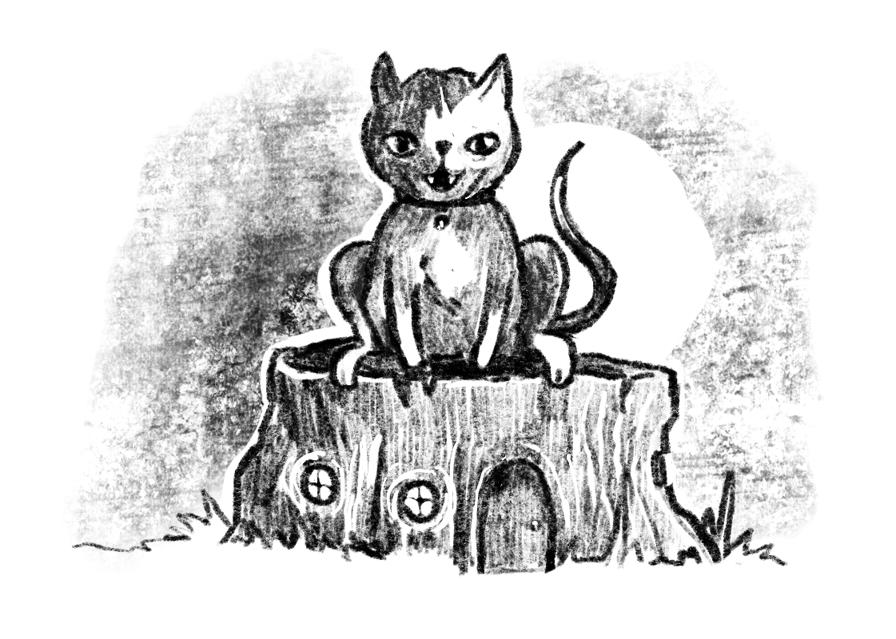

    

The civilised world holds on by a thread. The mouse kingdoms are dotted with the forgotten vestiges of past cultures. Even modern settlements can fall to disease, starvation or predation all too quickly. There are many places where lost wealth can be found by brave mouse adventurers.

This set of tables creates seeds for adventure sites — the dangerous dungeons, caves and abandoned settlements that your party of mice must brave to bring back treasure.

<table-roller table="adventure-sites" buttons='[["Random adventure site", {
    "History": "d20:History (d20)",
    "Ruination": "d12:Ruination (d12)",
    "Denizens": "d10:Denizens... (d10)",
    "Searching for/guarding": "d8:...searching for/guarding (d8)",
    "Secret": "d6:Secret (d6)"
}]]'></table-roller>

| Roll | History (d20)                    | Ruination (d12)         | Denizens... (d10)                     | ...searching for/guarding (d8)     | Secret (d6)                         |
|------|----------------------------------|-------------------------|---------------------------------------|---------------------------------------|-------------------------------------|
| 1    | Ancient bat cult temple          | Flooding                | Mice, driven mad or desperate         | A safe place to live or hide          | Monolith humming with arcane energy |
| 2    | Long-abandoned watchtower        | Magical mishap          | Mice, magically altered               | Cache of fine food                    | Preserved precursor beast           |
| 3    | Noblemouse's country manor       | Age and rot             | Rat bandits                           | Lost family or friend                 | Signs of human experimentation      |
| 4    | Hidden winter storehouse         | Human destruction       | Rat King's warband                    | Ancient, valuable artworks            | Forgotten grave of an ancient queen |
| 5    | Burial site of ancient mice      | Overrun by mould        | Original residents, strangely twisted | The last scraps in a picked-over ruin | Path into the veins of the earth    |
| 6    | Warren dug by rabbits or foxes   | Shifted between realms  | Ghostly spirits                       | Rare alchemical mushrooms             | Portal to faerie realm              |
| 7    | Human house or other building    | Attacked by great beast | Faerie advance guard                  | Strange and powerful spell            |                                     |
| 8    | Sewer or drainage pipes          | Disastrous storm        | Foul-tempered snake                   | Vast horde of pips                    |                                     |
| 9    | Claustrophobic ant-dug tunnels   | Haunting spirits        | Infestation of insects                |                                       |                                     |
| 10   | Massive tree, carved out by mice | Mysterious abandonment  | Cat lord and their servants           |                                       |                                     |
| 11   | Wizard's tower                   | Internal warfare        |                                       |                                       |                                     |
| 12   | Settlement's grain mill          | Disease                 |                                       |                                       |                                     |
| 13   | Rat king's nest                  |                         |                                       |                                       |                                     |
| 14   | Skeleton of a great beast        |                         |                                       |                                       |                                     |
| 15   | Witch’s academy                  |                         |                                       |                                       |                                     |
| 16   | Gatehouse to faerie realm        |                         |                                       |                                       |                                     |
| 17   | Deep mine                        |                         |                                       |                                       |                                     |
| 18   | Bandit's hideout                 |                         |                                       |                                       |                                     |
| 19   | Natural cave                     |                         |                                       |                                       |                                     |
| 20   | Mouse settlement                 |                         |                                       |                                       |                                     |
