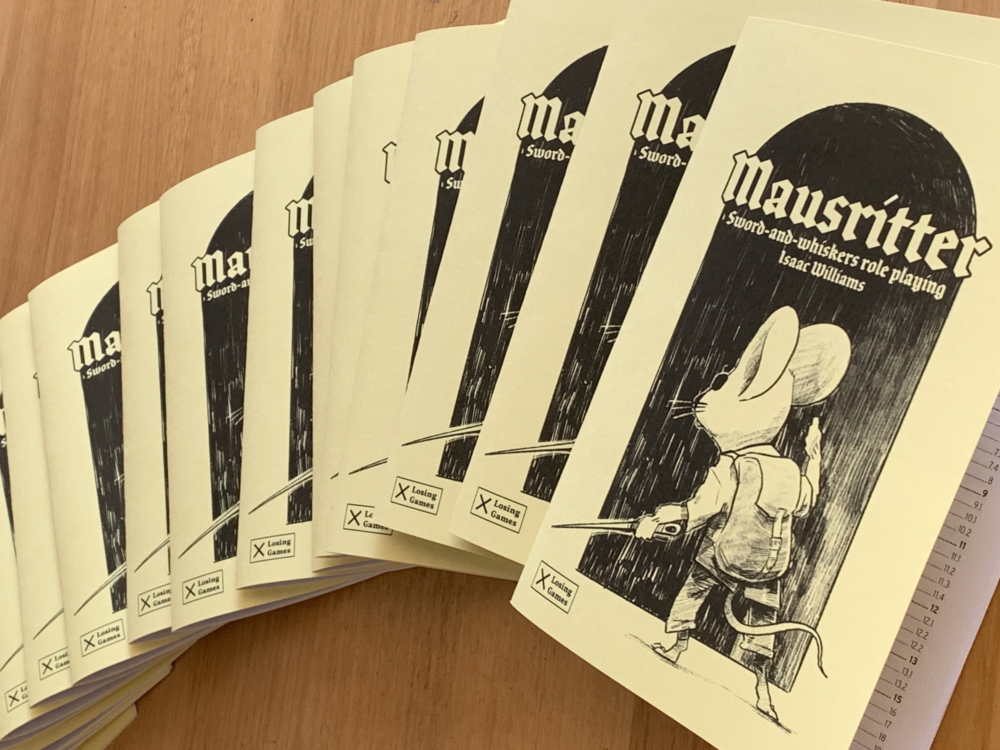
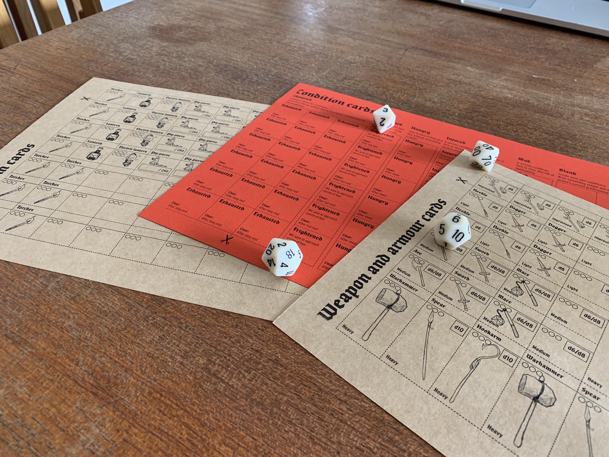

    

[Mausritter](/mausritter), my sword-and-whiskers hack of Into the Odd is out in the wild!

Mausritter began as my home game after my group gave up on a Mice & Mystics, and decided that we'd prefer to just be playing D&D (but keep the cute mice). I chose Into the Odd as the chassis to build it off, wrote up a background table and intro adventure, and started playing.

The game is very light on rules, but there's plenty of content and advice packed into the the book — enough for at least one short campaign.

## Get the game

Mausritter is available for $3 (or free) from [Itch.io](https://losing-games.itch.io/mausritter). I put together a small run of 25 print zines at release, which sold out within a day. I'm planning another print run in the near future.

## Inspirations and thanks

Mausritter is my love letter to the culture of hacking and iteration of the OSR blogosphere. It pulls in good ideas from many sources and tries to combine into a coherent, complete whole. Some sources of inspiration are:

- The basic mechanics of [Into the Odd](http://www.bastionland.com/2014/11/into-odd-full-version-print-and-pdf.html)
- Classless, item driven characters from [Knave](https://www.drivethrurpg.com/product/250888/Knave)
- [Magic](http://goblinpunch.blogspot.com/2016/09/the-glog-wizards.html) and [Triple-X item usage](https://goblinpunch.blogspot.com/2018/09/triple-x-depletion-unified-depletion.html) from Goblin Punch
- [Arts-and-crafts inventory slots](https://www.lastgaspgrimoire.com/arts-crafts-morbidly-encumbered-edition/) from Last Gasp Grimoire
- Reading [Mothership](http://www.tuesdayknightgames.com/mothership) inspired the focus on careful layouts, with each double-page spread devoted to a single idea

    

The only real innovation in the game is the Condition cards. They're inspired somewhat by the conditions in [Torchbearer](https://www.torchbearerrpg.com/), but take up inventory slots to double down on the focus on the player's gear. They're a great tool for GMs to give their players less-deadly consequences for failed saves, which still force them into hard choices — _should I carry this bag of pips and throw out my sword? Or should we take a rest to clear the Exhaustion, but risk more time in the snake's cave?_

## Tools

All of the GM-facing tools and tables are available as online generators:

- [Hexcrawl locations](/2019-07-24-mausritter-locations/)
- [Friendly mouse settlements](/2019-07-30-mausritter-settlements/)
- [Dangerous adventure sites](/2019-08-05-mausritter-adventure-sites/)
- [Adventure seeds](/2019-07-16-mausritter-adventures/)
- [Non-player mice](/2019-12-05-mausritter-npm/)

There's also an [online generator](/mausritter/mouse) for player mice, to get your players into the game instantly.

## Reviews

> The OSR has a bit of a reputation for producing rehashes of OD&D/BX and/or Keep on the Borderlands, and edgelord "body-horror lair of the tiddy-hydra" stuff. So it can be hard to draw outsiders' attention to great work that they might enjoy. Mausritter is one of the games I will now point to as an example of what the OSR is capable of — [Glaucus Hauriant](https://glaucushauriant.blogspot.com/2019/11/a-review-of-mausritter.html)
