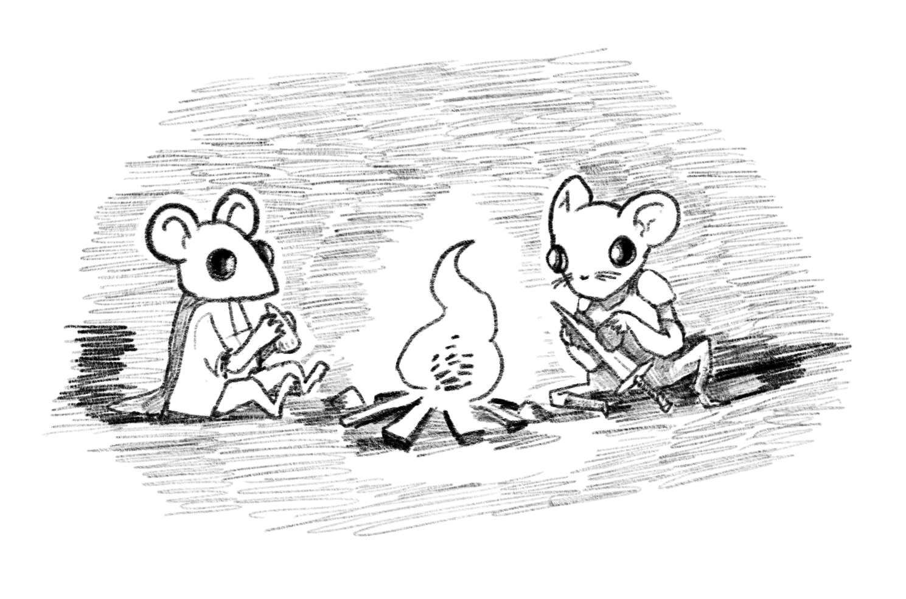

    

The mouse kingdoms are not called that for nothing. Mice of many varieties and social castes can be found throughout the kingdoms, each one with their own goals, desires and oddities.

These tables and random generator can help populate the lands. Spark ideas for a [patron in need](/2019-07-16-mausritter-adventures/) of the player's help, or give just enough details for the mayor of the [settlement](/2019-07-30-mausritter-settlements/) the players have wandered in to.

<table-roller table="characteristics" buttons='[["Random mouse", {
    "Name": "{FirstName} {LastName}",
    "Social position": "d6:SocialPosition",
    "  ": "DIVIDER",
    "Appearance": "{Appearance}",
    "Coat": "{CoatColor}, {CoatPatten}",
    "Quirk": "d20:Quirk",
    "   ": "DIVIDER",
    "Birthsign": "d6:Birthsign",
    "Wants": "d20:Wants"
}]]' data='{
    "SocialPosition": [
        "Poor (can pay 1d6p for service)",
        "Common (can pay 1d6p x 10p for service)",
        "Common (can pay 1d6 x 10p service)",
        "Burghermouse (can pay 1d6 x 50p service)",
        "Guildmouse (can pay 1d4 x 100p for service)",
        "Noblemouse (can pay 1d4 x 1000p for service)"
    ],
    "Birthsign": [
        "Star (Brave / Reckless)",
        "Wheel (Industrious / Unimaginative)",
        "Acorn (Inquisitive / Stubborn)",
        "Storm (Generous / Wrathful)",
        "Moon (Wise / Mysterious)",
        "Mother (Nurturing / Worrying)"
    ],
    "CoatColor": ["Chocolate","Black","White","Tan","Grey","Blue"],
    "CoatPatten": ["solid","brindle","patchy","banded","marbled","flecked"],
    "FirstName": ["Ada","Agate","Agnes","Aloe","April","Azalea ","Bay","Belladonna ","Blossom","Brie ","Brynn","Cherry","Claire","Crocus","Dahlia ","Daisy","Else","Emerald","Erin","Grace","Gwendoline","Hazel","Heather","Hette","Holly","Hyacinth","Iris","Juniper","Lavender","Lily","Magnolia ","Marigold","Marjoram ","Myrtle","Odette","Olive","Opal","Pearl","Pepper","Poppy","Rosemary","Rue","Saffron ","Sandy","Sassafras ","Shale","Susan","Thistle","Violet","Willow","Alder","Ambrose","Anise","Annotto ","August","Avens","Basil","Beryl","Birch","Boldo ","Bill","Burdock","Butter","Cassia","Chicory","Clive","Colby","Dill","Eared","Edmund","Elmer","Ernest","Fennel","Festus","Francis","Gil","Hawthorn ","Heath","Horatio","Jack","Jasper","Konrad","Larkspur","Laurel","Lorenz","Mace","Oliver","Orin","Reepicheep","Rowan","Simon","Sorrel","Stilton","Tarragon ","Warren ","Wattle","Wattle","Whitacre","Wormwood","Yarrow"],
    "LastName": ["Baiter","Black","Buckthorne","Burley","Butterball","Catreizen","Danger","Deerider","Grant","Halva","Maker","Pipp","Ratschlappe","Seedfall","Snow","Summerholme","Tunneler","White","Winterholme","Witter"]
}'></table-roller>

|d20|Appearance             |Quirk                  |Wants     |
|---|-----------------------|-----------------------|----------|
|1  |Soulful eyes           |Constantly grooming    |Freedom   |
|2  |Bright, patched clothes|Obsessed with weather  |Safety    |
|3  |Wreath of daisies      |Very high energy       |Escape    |
|4  |Grubby clothes         |Traveled, knowledgeable|Excitement|
|5  |Large floppy hat       |Cursed by a wizard     |Power     |
|6  |Pockets full of seed   |Scares easily          |Meaning   |
|7  |Bent twig walking stick|Ashamed of past crimes |Health    |
|8  |Carries rusted pinsword|Very competitive       |Wealth    |
|9  |Long, wild fur         |Flamboyant drunkard    |Protection|
|10 |Very, very old         |Extremely polite       |Love      |
|11 |Bandaged tail          |Unreservedly honest    |To protect|
|12 |Tail tied with a bow   |Slow, careful speech   |Food      |
|13 |Missing an ear         |Quick, erratic speech  |Friendship|
|14 |Long whiskers          |Secret servant of a cat|Rest      |
|15 |Twinkling eyes         |Raised by rats         |Knowledge |
|16 |Huge, heavy black cloak|Outcast from home      |Savagery  |
|17 |Old battle scars       |Many pet insects       |Beauty    |
|18 |Very young             |Hates being outdoors   |Revenge   |
|19 |Shaved fur             |Local hero             |To serve  |
|20 |Braided fur            |Very twitchy whiskers  |Fun       |

|d6 |Social position        |Payment for service    |
|---|-----------------------|-----------------------|
|1  |Poor                   |1d6p                   |
|2  |Common                 |1d6 x 10p              |
|3  |Common                 |1d6 x 10p              |
|4  |Burghermouse           |1d6 x 50p              |
|5  |Guildmouse             |1d4 x 100p             |
|6  |Noblemouse             |1d4 x 1000p            |

|d6 |Birthsign              |Disposition            |
|---|-----------------------|-----------------------|
|1  |Star                   |Brave / Reckless       |
|2  |Wheel                  |Industrious / Unimaginative|
|3  |Acorn                  |Inquisitive / Stubborn |
|4  |Storm                  |Generous / Wrathful    |
|5  |Moon                   |Wise / Mysterious      |
|6  |Mother                 |Nurturing / Worrying   |

