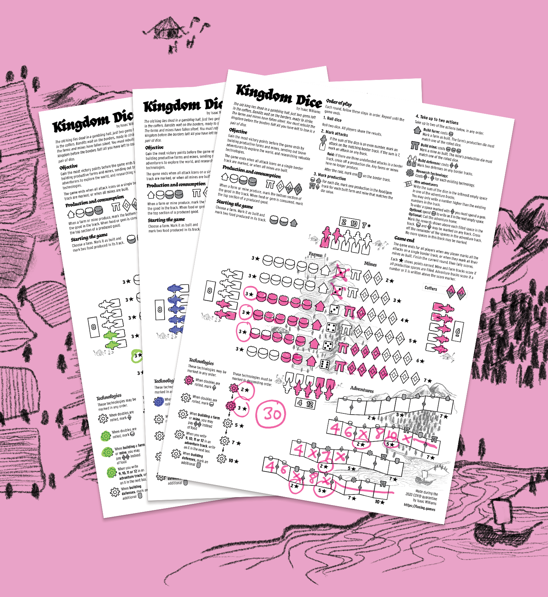
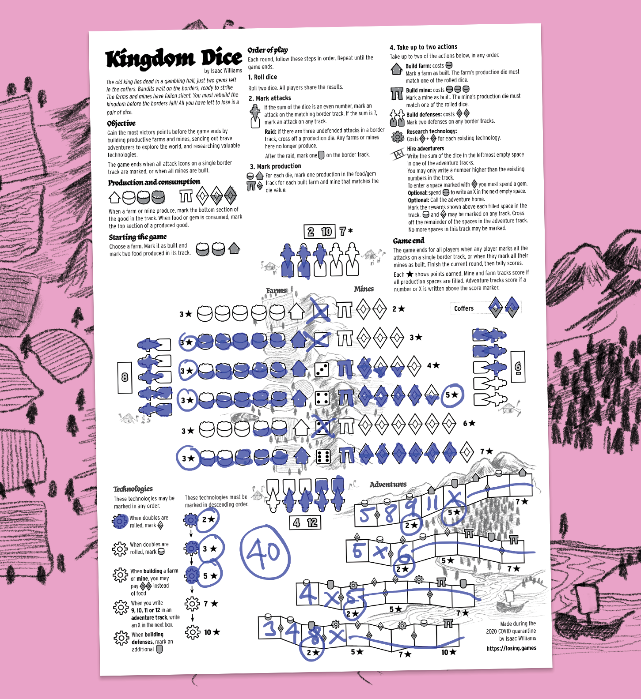

With the great Coronavirus lockdown of 2020, I've been spending a bit less time playing RPGs (it took a little while to get my Mausritter game back up and running online), and thinking about other games that lend themselves well to online play with friends. This led to spending the easter long weekend putting together a roll-and-write game.

    

In **Kingdom Dice**, you have ascended to the throne of a failing kingdom. The farms and mines have ceased to work, and bandits wait at the borders, looking for a chance to strike. You must rebuild the kingdom by constructing new farms and mines, investing in techlogogies and funding adventures, all before the kingdom inevitably falls again.

It's great for online play because all you need is two dice, rolled in person or online. Everyone playing along can make their choices for how they want to run their kingdom independant of the other players, then compare mistakes at the end.

[Download Kingdom Dice for free here](https://losing-games.itch.io/kingdom-dice).

    

Designing a single-page game is a great little challenge, highly recommended as a fun project that can be started and finished in a time-blocked manner. There's also almost no cost of entry. You can use free layout tools to create a pdf and put it online for people to enjoy.

Roll-and-writes as a genre are also wonderfully accessible as a source of design inspiration. All you need is a piece of paper, a source of randomisation and an idea. How hard can it be!? Making a _good_ roll-and-write game is of course a bit more tricky (and not something I claim to have achieved).
