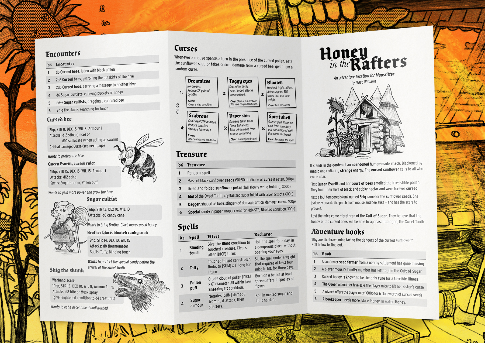
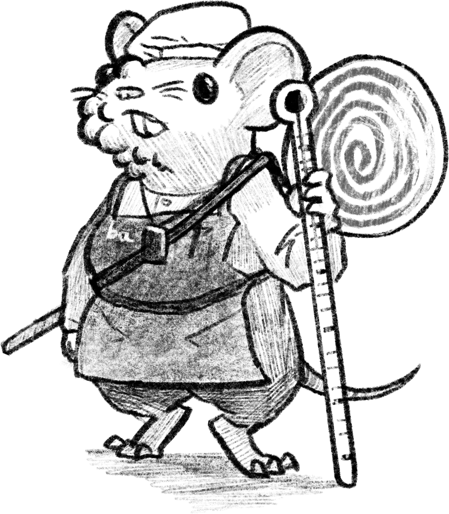

    

The first adventure location supplement for Mausritter is out! 

[Get it here from Itch.io!](https://losing-games.itch.io/mausritter-honey-in-the-rafters)

Honey in the Rafters is a 2-page pamphlet adventure location that tasks the player mice with negotiating the dangers of a cursed sunflower and those who seek its power. The supplement contains a cutaway map of an abandoned human-made shack and the surrounding overgrown sunflower garden. All up, there's 10 keyed locations, plus new antagonists, treasure and spells.

    

The adventure works well as a one-shot or can be easily dropped into an existing Mausritter campaign. In addition to this, the adventure attempts to act as a demonstration of the basic faction-focused adventure design principals laid out very briefly in the Mausritter rulebook.

> Populate the adventure sites with two different factions that have competing goals. 

In this case, there are three factions already competing and interacting as the players arrive — Cursed bees, Sugar cultists, and an ornery Skunk.

Each of these factions pose a significant threat to the player mice if tackled head-on. But if they are clever, the players will be able to play the factions off each other and take advantage of the chaos.

The adventure has been in development for a few months, mostly on the backburner as I waited to get my Mausritter game up-and-running online so it could be properly play-tested (and worked on other, top secret Mausritter-related projects). Thanks much my playtest group for pushing hard on the draft adventure, and helping flesh out the details that are hard to make up on the fly!