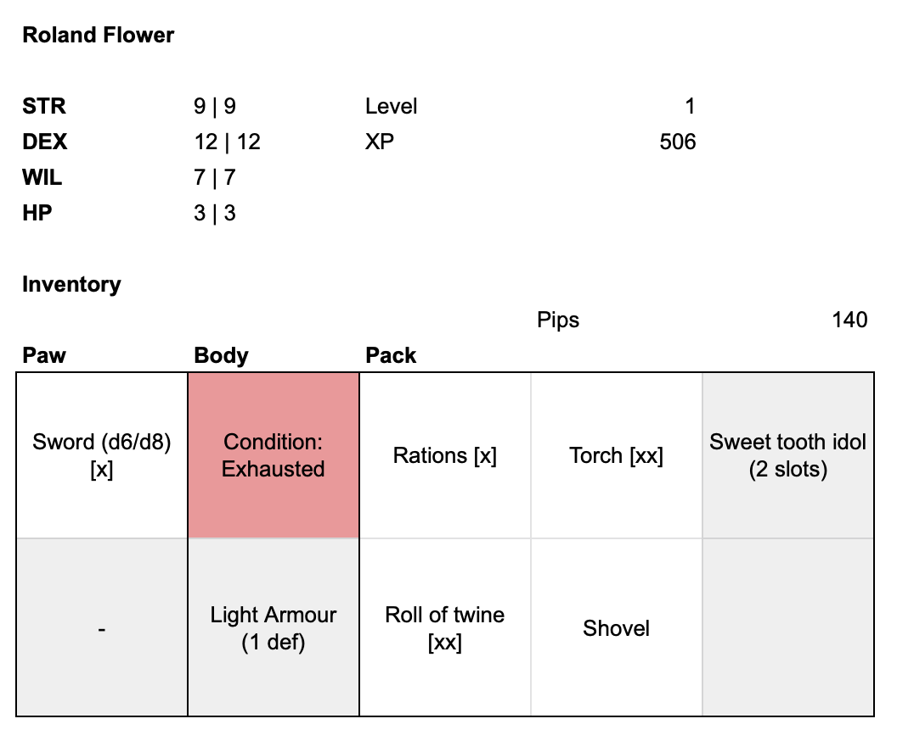
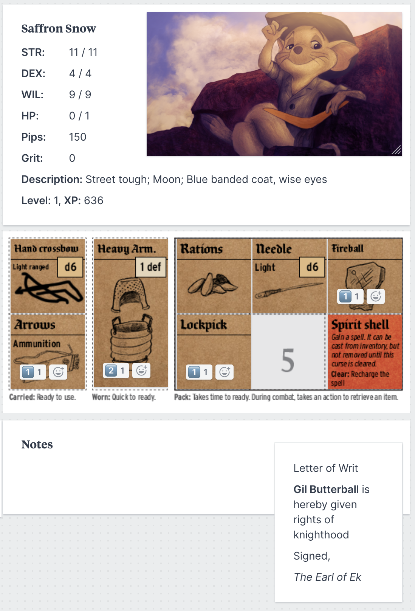

This post is going to be a fairly practical guide on how to options for handling Mausritter's unique inventory system in online play. This won't cover voice/video chat and rolling dice (a lot of people like [Roll20](https://roll20.net/) but I find it a bit clunky. [Discord] is solid, but has no visual component. My group uses a combination of Google Hangouts and [Rolz](https://rolz.org/))

One of Mausritter's main features as an RPG ruleset is the inclusion of physical tokens for your character's inventory. These are great fun in person, and make for a inventory system that players actually _want_ to pay attention to. But with the world forced to play RPGs remotely now, how to play Mausritter?

There's a few options here. None are perfect, but they're all usable.

## 1. Ignore the cards

Ignore the physical card systems, and just use a flat list of    items in inventory slots with text, marking Usage with [x].

| Slot     | Contents
|----------|-------------------
| Main paw | Sword (d6/d8) [x]
| Off paw  | --
| Body     | Condition: **Exhausted**
| Body     | Light armour (1 def, off paw slot)
| Pack 1   | Rations [x]
| Pack 2   | Torch [xx]
| Pack 3   | Sweet tooth idol (2 slots)
| Pack 4   | --
| Pack 5   | Roll of twine [xx]
| Pack 6   | Shovel

**Pros:** Very little overhead, and it'll work in whatever tool you're already using for online play. You can list inventory items in a Roll20 character sheet, or in a shared Google Doc.

**Cons:** Lacks some of the fun and physicality of moving cards around, and you need to remember the specific rules around 2-slot items, especially Light and Heavy Armour.

## 2. Spreadsheet

    

Use a shared Google Sheet to manage the character sheet, then write the items into cells. I've [set up a template](https://docs.google.com/spreadsheets/d/1Ez24OfD0RLZf61oR_HzG1pOEgbyOSNh8O26L6vjdZoI/edit?usp=sharing) that can be used for this in Google Sheets — just us the **File -> Make a copy** option to create your own editable copy.

**Pros:** Simple to set up and use. Most people have a google account and are familiar enough with Google Sheets.

**Cons:** Handling of items that are larger than one slot is still a bit inelegant, and moving items around is a bit awkward.

## 3. Digital cards

    

This is what I've been doing with my online group, using [Milanote](https://milanote.com) (an online service for organising creative projects I happen to work on as my day job). Using Milanote, you can upload images of cards, then drag them around to represent the items in your inventory.

I've created digital cards for [all the basic items and condition cards](./mausritter-item-cards.zip) shown in the Mausritter rulebook (plus a few extras). Past that you'll need to create your own cards using an image editor. Emoji reactions within Milanote on the item cards to show Usage dots.

**Pros:** Fun and tactile. Players can place cards in their inventory as if they were playing physically. Sharing a item between players is as easy as dragging the card to another character sheet. Milanote can also be used as an online table for maps and other player-facing material.

**Cons:** Players will need to sign up and familiarise themselves with a tool they probably don't already use. Creating new item cards requires an image editor (or using a substitute card and creating a note show explain what it is). Milanote's free plan is somewhat limited, though should be fine for this purpose.
