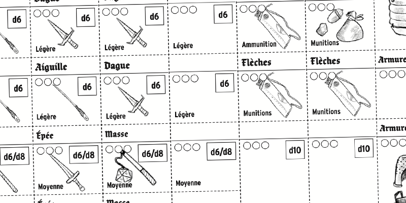

A translation of Mausritter is now available in French! The translation has been in the works for some time, so it’s really exciting to see it out in the world. Thanks so much to Nicolas “Gulix” Ronvel for the fantastic translation, and working hard to maintain Mausritter’s particular layouts.

[Get it here from DriveThruRPG!](https://losing-games.itch.io/mausritter-honey-in-the-rafters)

We’ve translated everything too; character sheets, GM sheet, item and condition cards. It’s honestly worth checking out if you don’t read French for the great new lists of mouse names.

Here’s Nicolas on the translation process:

> Il y a quelques mois, j’ai découvert Mausritter sur itch.io. Grâce à sa couverture, principalement.  
> Ce jeu de rôle vous permet d’incarner des souris aventurières dans un monde à leur échelle, teinté de fantastique et de créatures intelligentes.  
> Beaucoup de choses m’avaient plu dans ce jeu. Les règles claires et limpides, inspirées de Into the Odd. La présentation travaillée et intelligente, avec une séparation des thèmes par page. Des tables aléatoires très intéressantes pour lancer un bac à sable. Et des illustrations très réussies par Isaac Williams, également auteur du jeu. Et pourtant, le genre OSR n’est pas trop ma tasse de thé. Mais raconter ces histoires de souris à leur échelle, avec leurs dangers, m’a rappelé l’excellente lecture des Légendes de la Garde.   
> J’avais donc craqué, et demandé à l’auteur si une version française était envisageable. Oui, cela l’était.   
> La version française est maintenant une réalité.    
> Cela a pris un peu de temps, avec plusieurs allers-retours pour valider la traduction, pour l’adapter à la mise en page, pour vérifier que rien n’ait été oublié. Mais voilà, c’est fait.   
> Plongez dès aujourd’hui dans les royaumes souris avec Mausritter, le jeu de rôle fantastique avec épées et moustaches.   
> Plongez-y en français, et faites vivre d’incroyables aventures à vos petites souris !   

[Read more about it on his blog](https://www.gulix.fr/blog/2020/05/11/mausritter-en-francais/)