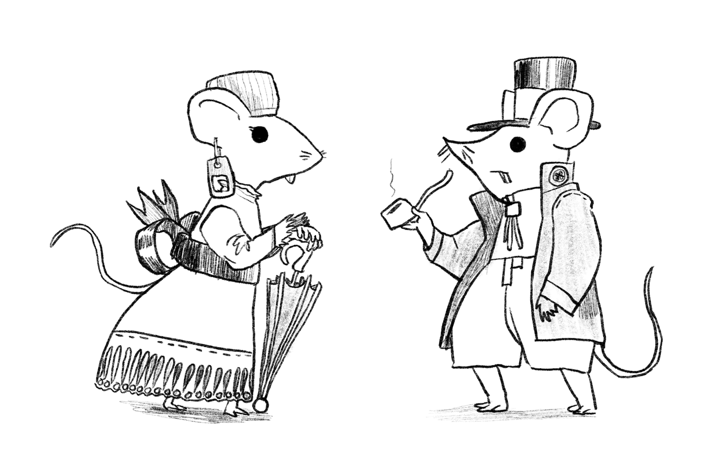

My Mausritter players have finally made the trek to the Big City, and after a year of play I've used up too many entries on the list of names in the core book, so here are d100 + d20 additional names for mice.

This time the name tables are for those sophisticated city-slicker mice, always running around with their noses in the air, chasing after deals and meals. 

    

<table-roller table="names" buttons='[["Random name", {
    "Name": "{name} {matriname}"
}]]' data='{
    "name":["Almond","Apple","Bit","Blaze","Bobbin","Brioche","Cashew","Chiffon","Cinder","Cricri","Crouton","Crumpet","Dimity","Dosa","Dumpling","Dungaree","Edna","Essell","Frieze","Gertrude","Gingham","Hodden","Inglenook","Isabella","Karen","Lee","Lintel","Lisa","Marie","Melon","Mertle","Moffit","Organdy","Oxide","Perron","Pick","Portia","Puff","Reece","Scarlet","Scrap","Sharon","Shingle","Soot","Sophia","Sprocket","Terra","Trix","Twill","Zero","Bagel","Belfry","Benjamin","Bing","Bonbon","Browser","Burlap","Calico","Capp","Chintz","Clark","Clipp","Corozo","Draff","Dril","Durk","Ernest","Filbert","Freddo","Fudge","Gable","Grommet","Henry","Jabot","Java","John","Kenneth","Knipp","Liam","Ludd","Loom","Mansard","Oriel","Otis","Pace","Patch","Peanut","Pop-top","Raffle","Ron","Sasha","Shank","Shuttle","Tagg","Timtam","Tin","Toby","Waffle","Wainscot","Wurst"],
    "matriname": ["Algernon","Boiler","Bunting","Butterball","Crunch","Darnden","Frondless","Grey","Guarde","Jammy","Kit","Looper","Noodlemarn","Peak","Roader","Silt","Steeple","Trapper","Weezle","Wok"]
}'></table-roller>

## Birthnames

|   d100  |   Name       |   d100  |   Name      |   d100  |   Name      |   d100  |   Name      |
|---------|--------------|---------|-------------|---------|-------------|---------|-------------|
|   1     |   Almond     |   26    |   Lee       |   51    |   Bagel     |   76    |   John      |
|   2     |   Apple      |   27    |   Lintel    |   52    |   Belfry    |   77    |   Kenneth   |
|   3     |   Bit        |   28    |   Lisa      |   53    |   Benjamin  |   78    |   Knipp     |
|   4     |   Blaze      |   29    |   Marie     |   54    |   Bing      |   79    |   Liam      |
|   5     |   Bobbin     |   30    |   Melon     |   55    |   Bonbon    |   80    |   Ludd      |
|   6     |   Brioche    |   31    |   Mertle    |   56    |   Browser   |   81    |   Loom      |
|   7     |   Cashew     |   32    |   Moffit    |   57    |   Burlap    |   82    |   Mansard   |
|   8     |   Chiffon    |   33    |   Organdy   |   58    |   Calico    |   83    |   Oriel     |
|   9     |   Cinder     |   34    |   Oxide     |   59    |   Capp      |   84    |   Otis      |
|   10    |   Cricri     |   35    |   Perron    |   60    |   Chintz    |   85    |   Pace      |
|   11    |   Crouton    |   36    |   Pick      |   61    |   Clark     |   86    |   Patch     |
|   12    |   Crumpet    |   37    |   Portia    |   62    |   Clipp     |   87    |   Peanut    |
|   13    |   Dimity     |   38    |   Puff      |   63    |   Corozo    |   88    |   Pop-top   |
|   14    |   Dosa       |   39    |   Reece     |   64    |   Draff     |   89    |   Raffle    |
|   15    |   Dumpling   |   40    |   Scarlet   |   65    |   Dril      |   90    |   Ron       |
|   16    |   Dungaree   |   41    |   Scrap     |   66    |   Durk      |   91    |   Sasha     |
|   17    |   Edna       |   42    |   Sharon    |   67    |   Ernest    |   92    |   Shank     |
|   18    |   Essell     |   43    |   Shingle   |   68    |   Filbert   |   93    |   Shuttle   |
|   19    |   Frieze     |   44    |   Soot      |   69    |   Freddo    |   94    |   Tagg      |
|   20    |   Gertrude   |   45    |   Sophia    |   70    |   Fudge     |   95    |   Timtam    |
|   21    |   Gingham    |   46    |   Sprocket  |   71    |   Gable     |   96    |   Tin       |
|   22    |   Hodden     |   47    |   Terra     |   72    |   Grommet   |   97    |   Toby      |
|   23    |   Inglenook  |   48    |   Trix      |   73    |   Henry     |   98    |   Waffle    |
|   24    |   Isabella   |   49    |   Twill     |   74    |   Jabot     |   99    |   Wainscot  |
|   25    |   Karen      |   50    |   Zero      |   75    |   Java      |   100   |   Wurst     |

## Matrinames

|   d20  |   Matriname   |
|--------|---------------|
|   1    |   Algernon    |
|   2    |   Boiler      |
|   3    |   Bunting     |
|   4    |   Butterball  |
|   5    |   Crunch      |
|   6    |   Darnden     |
|   7    |   Frondless   |
|   8    |   Grey        |
|   9    |   Guarde      |
|   10   |   Jammy       |
|   11   |   Kit         |
|   12   |   Looper      |
|   13   |   Noodlemarn  |
|   14   |   Peak        |
|   15   |   Roader      |
|   16   |   Silt        |
|   17   |   Steeple     |
|   18   |   Trapper     |
|   19   |   Weezle      |
|   20   |   Wok         |