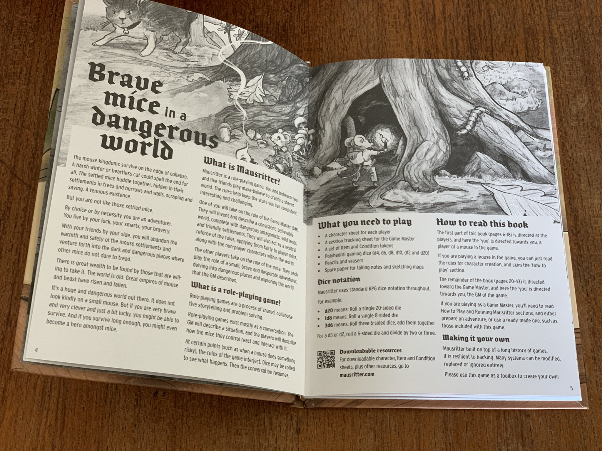
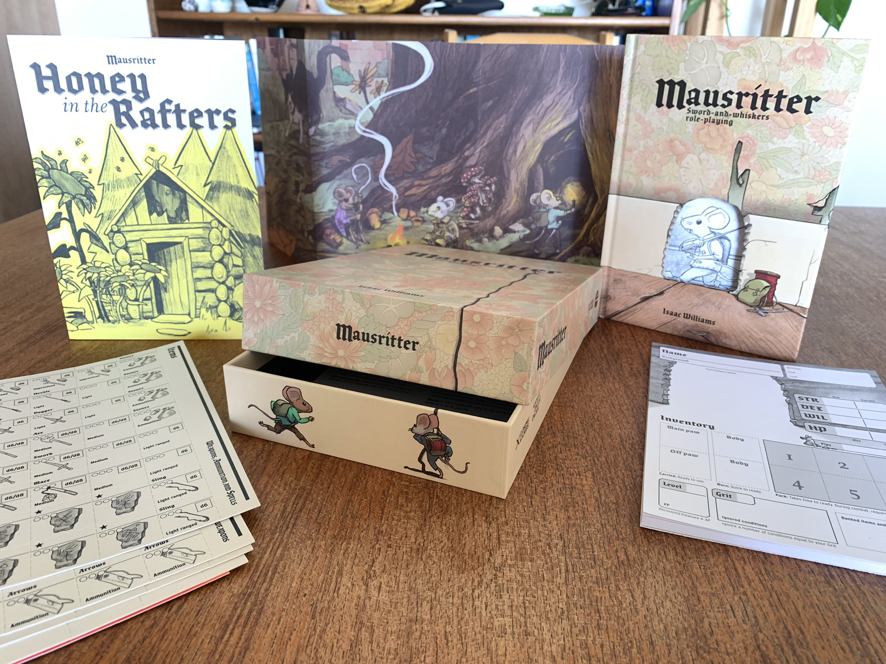

It's been just under a year since the zine edition of Mausritter first launched, and so it's really exciting to bring you all this new **expanded edition**. For the past six months or so I've been hard at work, writing, illustrating, designing and playtesting this new expanded rulebook and preparing for the print release.

    

You can get the new, expanded version of Mausritter, [pay-what-you-want from Itch.io](https://losing-games.itch.io/mausritter). The print edition of the new book is also available, published by [Games Omnivorous](https://gamesomnivorous.com). The book and box set are lovingly produced. We've sweated every detail to try to bring you an amazing product.

The new content doesn't change the fundamentals of Mausritter — it's an expansion, filling in the details and providing the missing tools and clarifications that were most commonly brought up since the game's launch. Inside, you'll find the same tight design, tighter layouts and simple, easy to digest rules, now expanded out to 48 pages.

The new content provides an **example of play**, to demonstrate how I think the game is best played, and significant new aids for the GM's toolbox. There's procedures for **creating Mouse-scale adventure sites**, complete with tables for **treasure** and **magic swords**, and a new simple system for managing the larger-scale **factions** within a sandbox campaign. Finally, the game is ready to play with the new **one-page adventure site** of **Stumpsville**.

In addition to the edition of Mausritter, I've also launched a [dedicated website](https://mausritter.com), giving the game more space to grow than this blog provides. There's [now a section](https://mausritter.com/#resources) for **third-party resources**, and we have plans to add more **companion adventures** over time to help you run a wide variety of mouse-scale adventures without having to invent them yourself.

    

Thanks so much to everyone who has played, talked about, reviewed and made content for Mausritter so far. It's been amazing to see the community around the game grow. I hope that this new edition brings you many more hours of gaming fun and imagination with your friends and family!

*It's a huge and dangerous world out there for a small mouse. But if you're very brave, and very clever and just a bit lucky, you might just survive.*