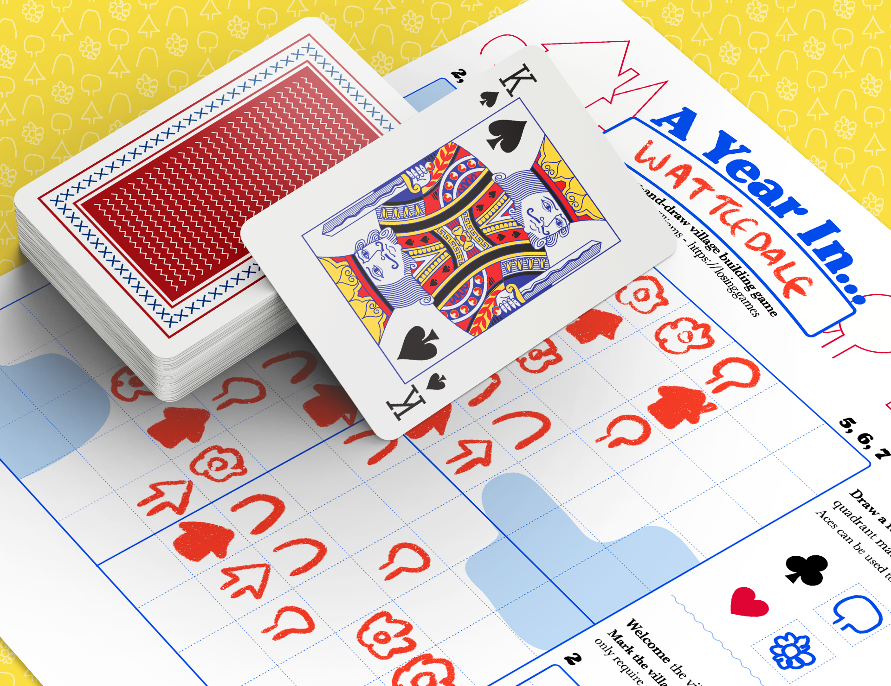
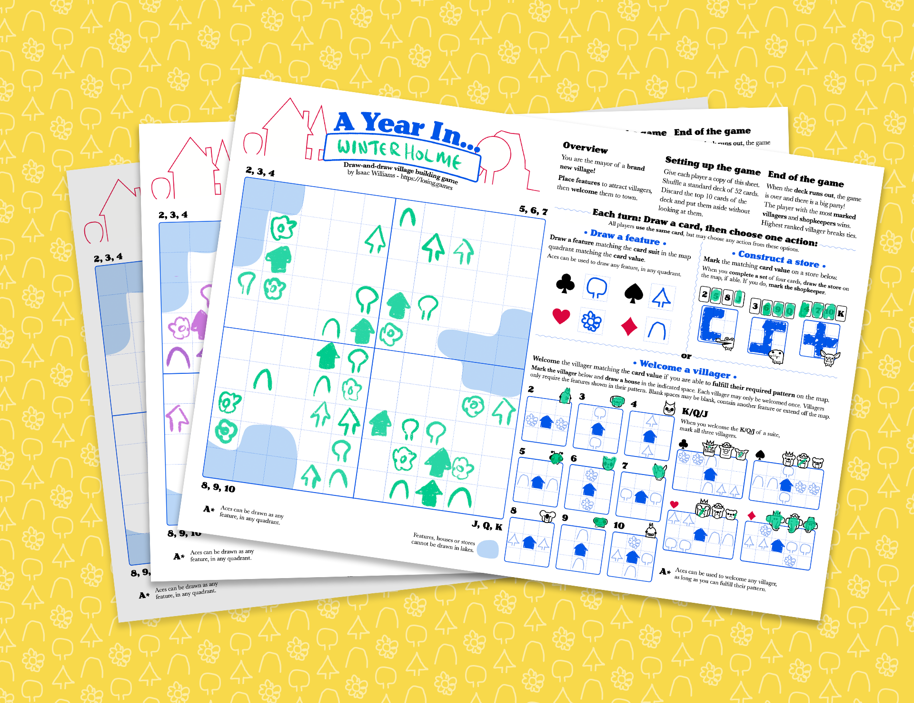

I've just released another new game, my third (and last) for the year!

    

Like [*Kingdom Dice*](/2020-04-19-roll-and-writes), *A Year In...* began development while in Coronavirus lockdown, very soon after the completion of Kingdom Dice. It was supposed to be another quick 2-3 week development, but blew out when the systems felt *fun* but not *complete*. Then development of the [Mausritter expanded book](/2020-11-25-mausritter-expanded) grew to take all my time and *A Year In...* was shelved. With Mausritter finally finished, I decided to knuckle down and develop *A Year In...* from interesting to good. 

[Download *A Year In...* for free here](https://losing-games.itch.io/a-year-in).

    

*Kingdom Dice* showed that the one-page roll-and-write was a really compelling, fun to develop game format. For *A Year In...* I wanted to try another source of randomisation, thus the genre naming of "draw-and-draw". It was also a chance to push myself to avoid my usual game design instincts towards creating strictly contained, interlocking economic systems. Not everything has to be a Eurogame!  

Hope you check it out. Leave a comment on Itch, or [message me on Twitter](https://twitter.com/isaacwilliams) if you play it and have any thoughts or questions!