This post was originally an [unwieldy thread on Twitter](https://twitter.com/isaacwilliams/status/1339502240780800000). Cleaned up a bit for here.

I started work on [A Year In...](/2020-12-17-a-year-in) in April this year, just after finishing Kingdom Dice. It ended up taking a bit longer, but luckily I've saved files of each version, so I can do a step-by-step of how it evolved.

    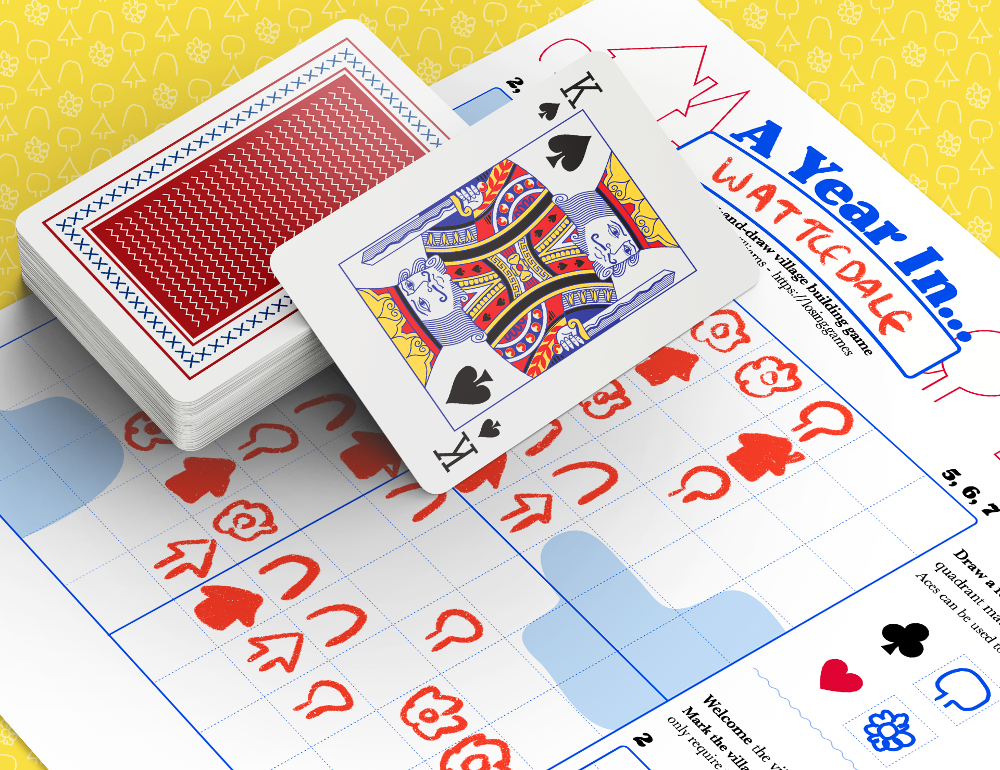

It was meant to be another quick 2-3 week project, after [Kingdom Dice](/2020-04-19-roll-and-writes) showed that the one-page roll and write format was a fun one to design for, but it ended up taking a bit longer.

### Version 1

The first version laid down the bones. I knew it would use playing cards as a randomiser, and that it would be about drawing a little town and matching patterns.

    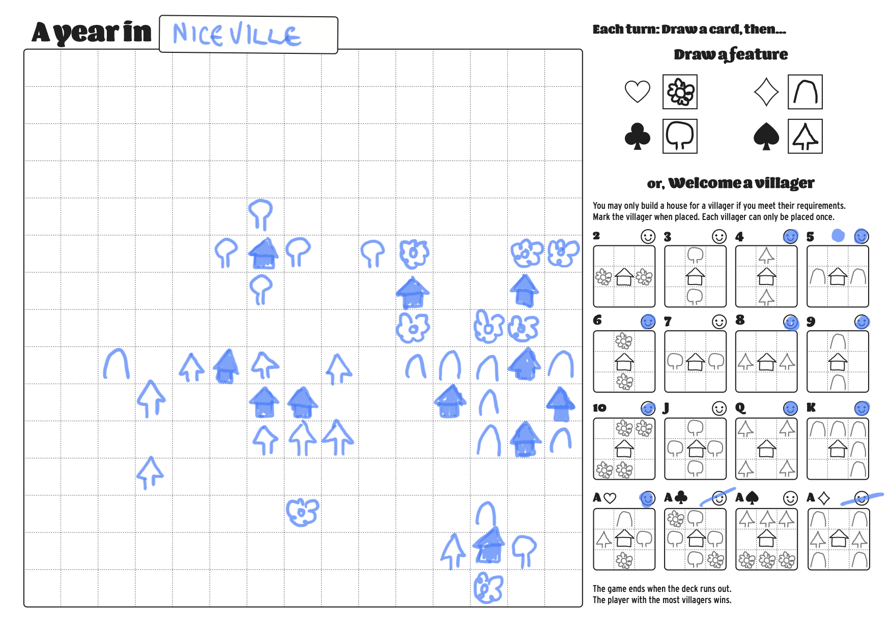

One cool thing you might not know about playing cards: Each one has two different pieces of information on them! The density is off the charts!

So early on I wanted to take advantage of that: Use the suites for placing features, values for placing houses.

### Version 2

The first version *worked*, but definitely felt very amorphous and directionless. Why should I place this feature here? Why go for this pattern over that one? 

Version 2 tried to remedy this by shrinking the play area and adding some oddly-shaped lakes. Which didn't really work. It was more pressured, but didn't solve the issue of not feeling like there were any tricky decisions to make.

    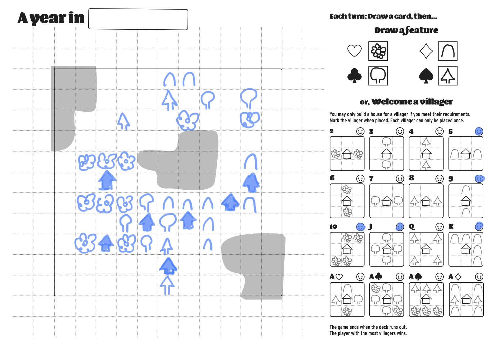

### Version 3

Then I (or someone in my game design group chat) had the brilliant idea of tying cards to quadrants on the map. Suddenly it felt more like a game. There were tricky decisions and gambles.

    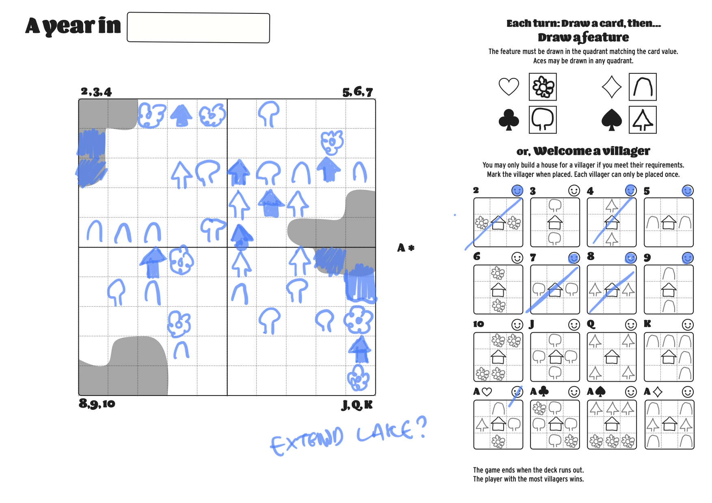

There was still a problem (which would haunt me til the end), that sometimes you just didn't have anything good to do with a turn. There was no pattern you could match, and no useful place to put a feature.

### Version 4

Version 4 attempted to give you something to do with a card when you didn't want to place a feature — extend a lake instead! It worked... okay, but just didn't feel thematically compelling and you would again end up in a situation where there was not much to do.

    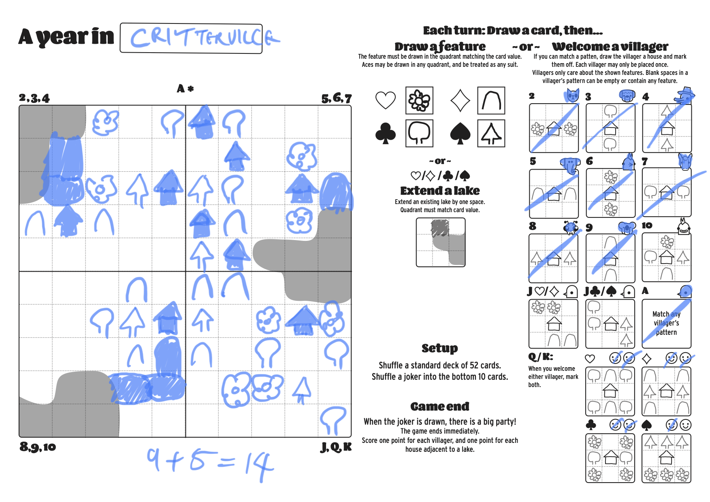

This version started replacing the :simple_smile: villagers with cute animals. It was April and I was playing a lot of Animal Crossing, so knew that collecting a village of cute animals is very satisfying.

### Version 5

Version 5 introduced a party! Instead of drawing a feature of welcoming a villager, you could spend a card to mark a track, earning a bonus point if you filled it. It gave you something to do, but felt disconnected from the rest of the game.

    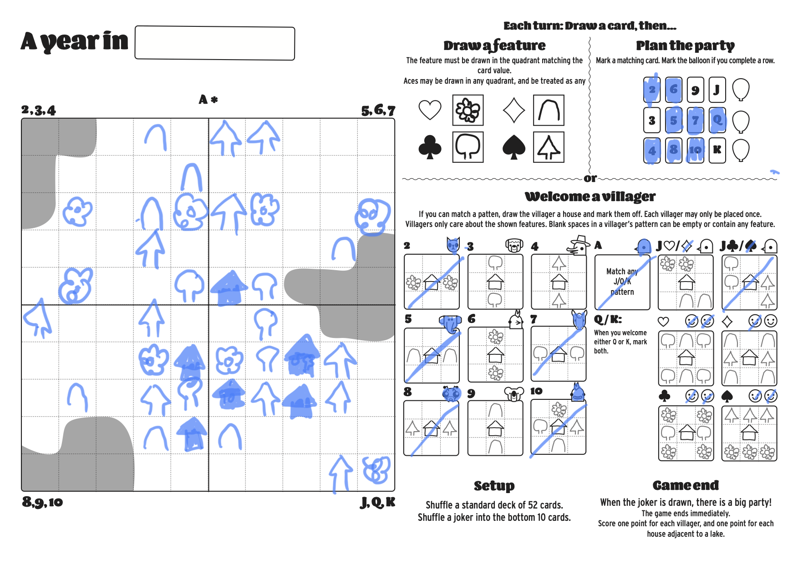

### Version 6

Version 6 added the stores! Now it's looking pretty close to where it finished. The stores felt good, and much more connected to the map game — you had to plan out what you were doing to leave space.

    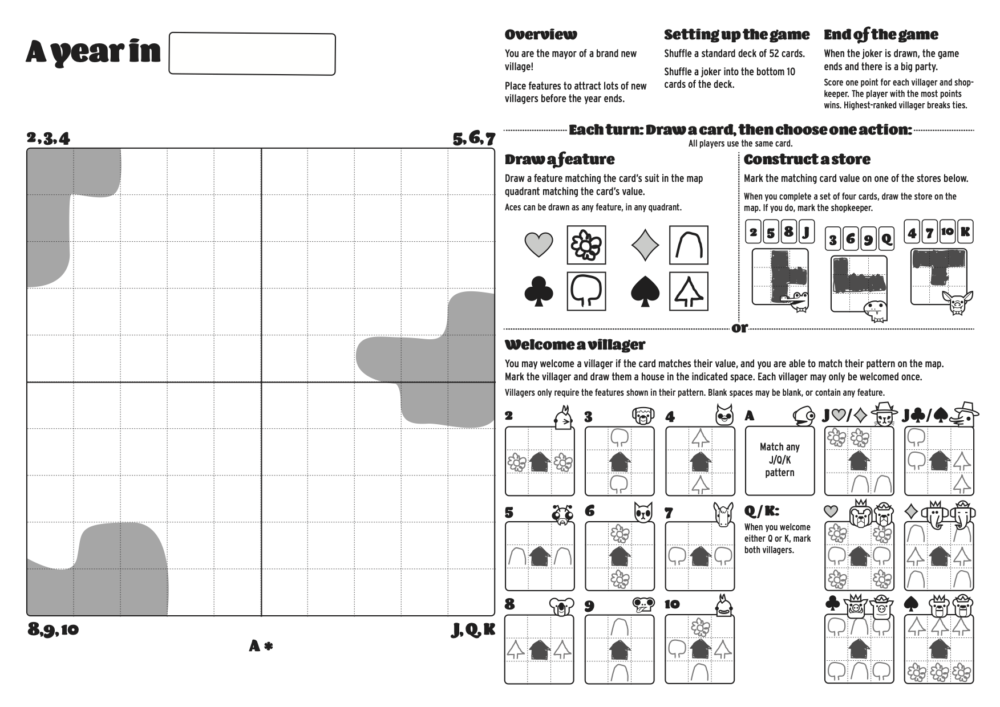

### Version 7

...but not that much space, which is why version 7 made them more annoying shapes, and harder to fit into the board in the late game.

    

And that's where I left it for 6 months. It felt pretty good, but not *done*, and all of my writing, playtesting and drawing time needed to be spent on finishing the [extended edition of Mausritter](https://mausritter.com).

### Version 8

Six months later, Mausritter was done and it was time to close out old projects. With version 8 I decided to go crazy and add some colours. First ugly...

    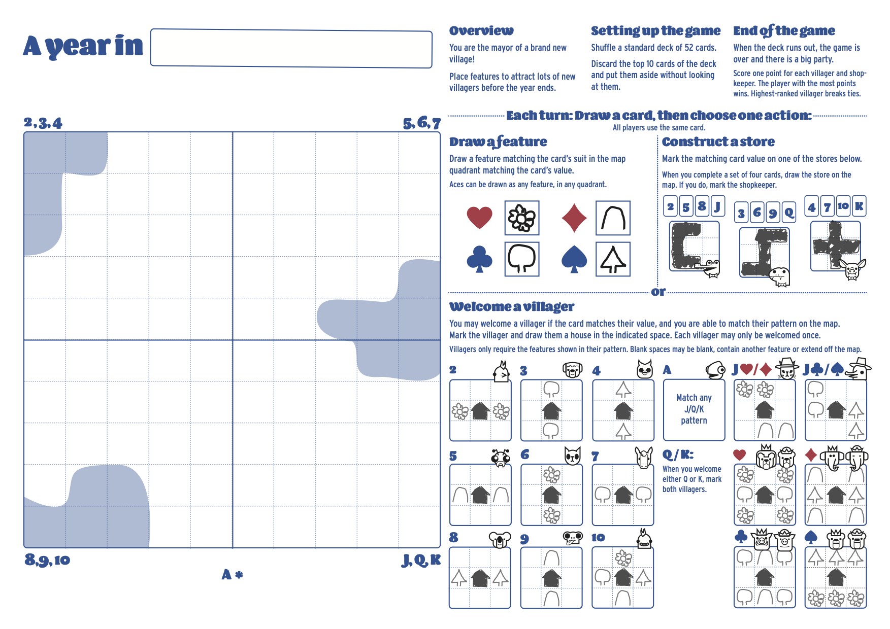

### Version 9

...then nicer.

    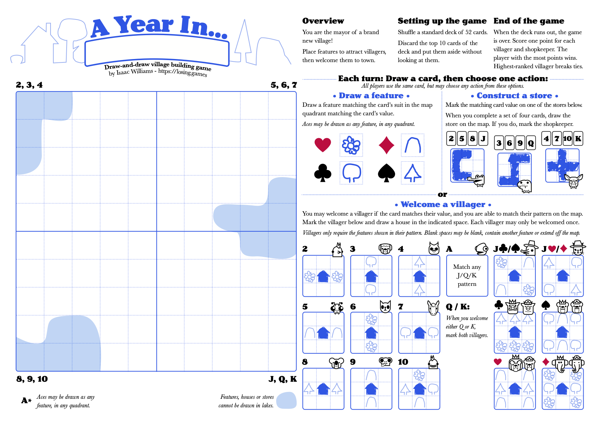

### Version 10

Version 10 took a short detour into changing out the Stores for Paths — the idea there was to give a bit more creative control, and make the judicious use of paths an avenue for higher-skill players.

    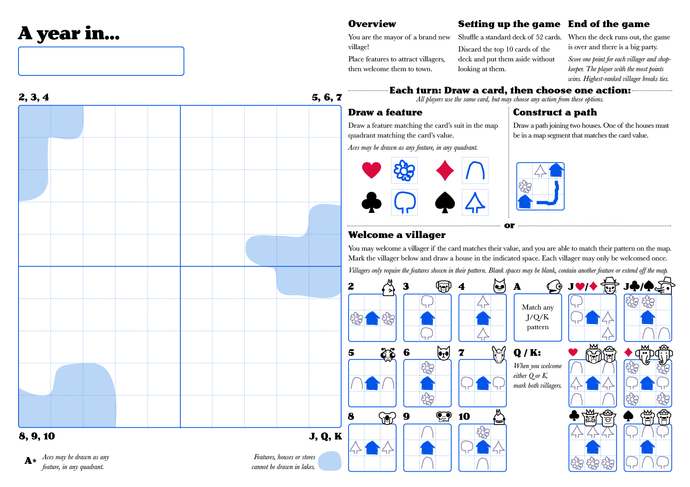

This didn't work. Because the paths rely on players already having houses on the map, the lack of an early-game outlet for cards that aren't serving a useful purpose got back to the bad game-feel of the variants before the Store.

### Version 11

In version 11, the Stores were back but the patterns required for K/Q/J villagers had gotten bigger and more challenging to match.

    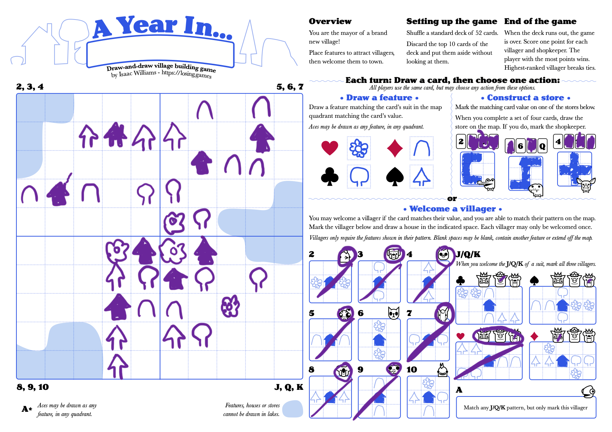

This was the higher-skill activity I was looking for. Creating the patterns for the K/Q/J is requires planning from the very start of the game. The reward of three villagers for their completion matches the challenge and gives players something to aim for.

### Version 12

At this point, I was ready to call the game done. Version 12 was just tweaks to formatting.

    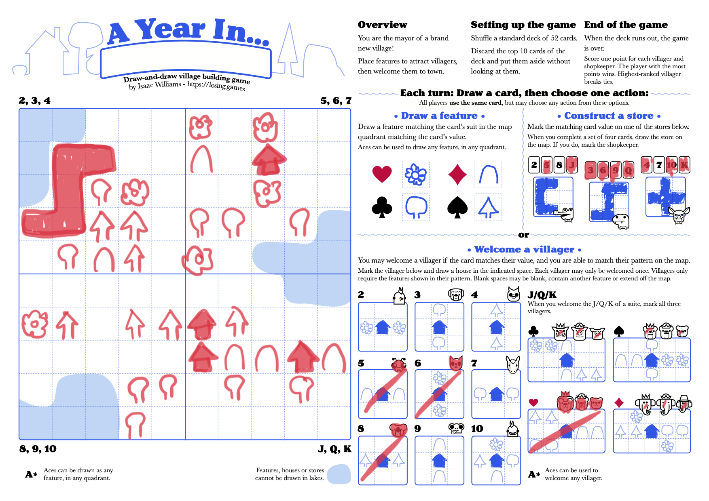

### Version 13

And version 13 was final experiments with scoring. Attempted to try the *1 point per house adjacent to a lake* rule from all the way back in version 4. This still felt unsatisfying and didn't really add a meaningful differentiation between player's scores. You would just cluster around lakes instead of not doing so.

    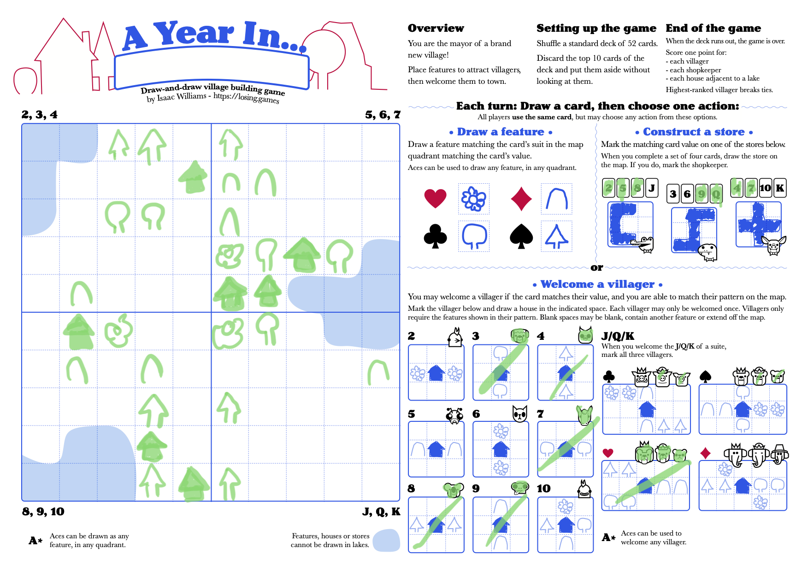

### Version 14 — complete!

Version 14 took a final pass at formatting, tweaks to some of the wording for clarity (thanks to Peter C. Hayward — [check out his games, they're good](https://jellybean.games/)) and it's a finished game.

    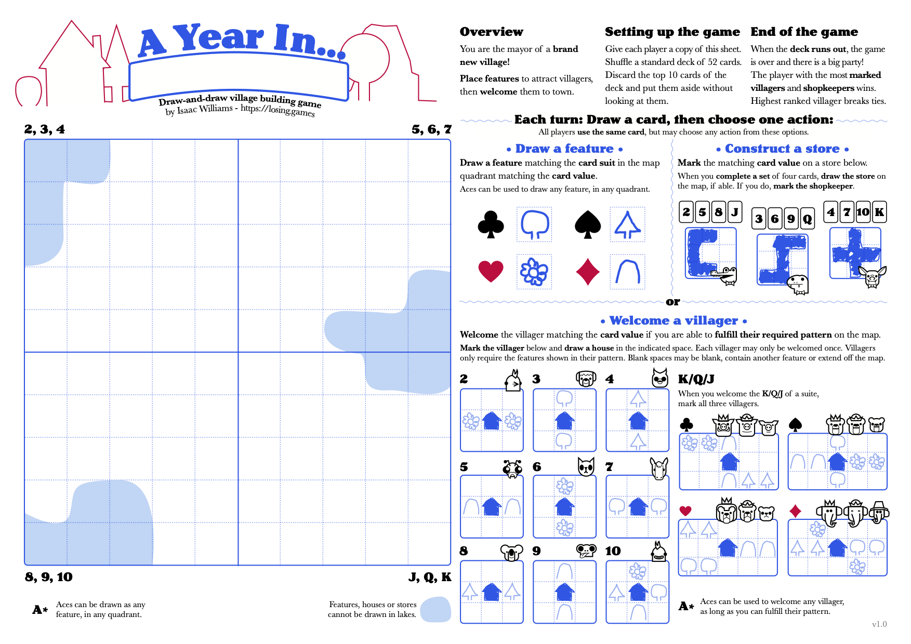

There's definitely still issues with the scoring and some of the late game, depending on how the card draw goes. But it's still a fun and interesting little puzzle. Drawing little trees and flowers, and colouring in a house when you finally earn it is very satisfying.

[Go give it a play](https://losing-games.itch.io/a-year-in), and leave a review or let me know on Twitter ([@isaacwilliams](https://twitter.com/isaacwilliams)) what you think!
