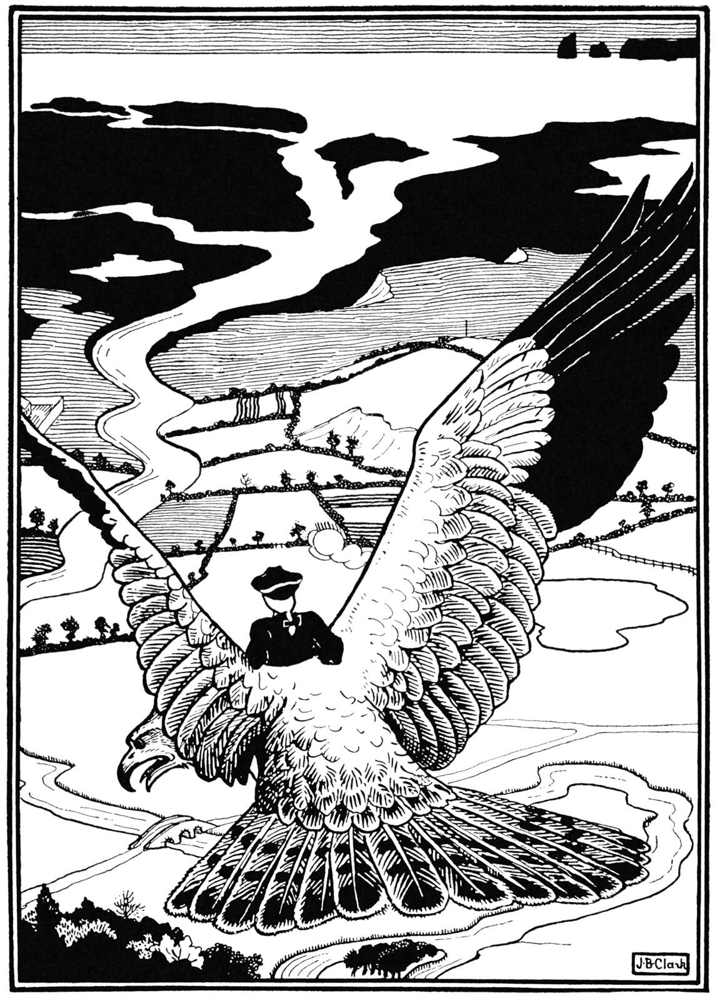
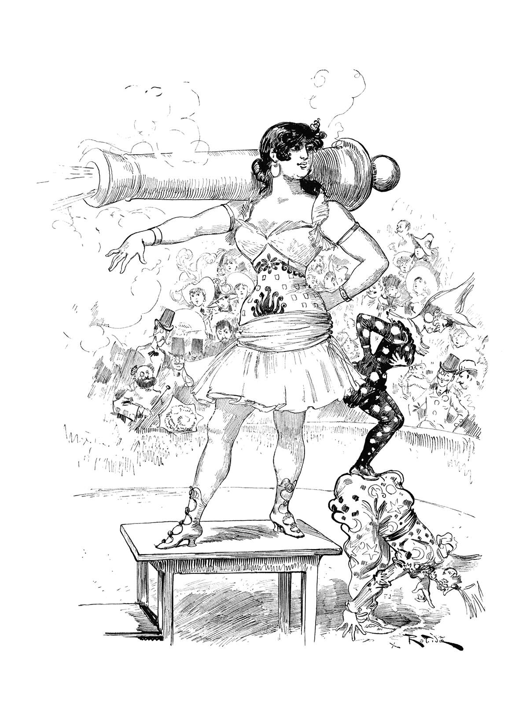
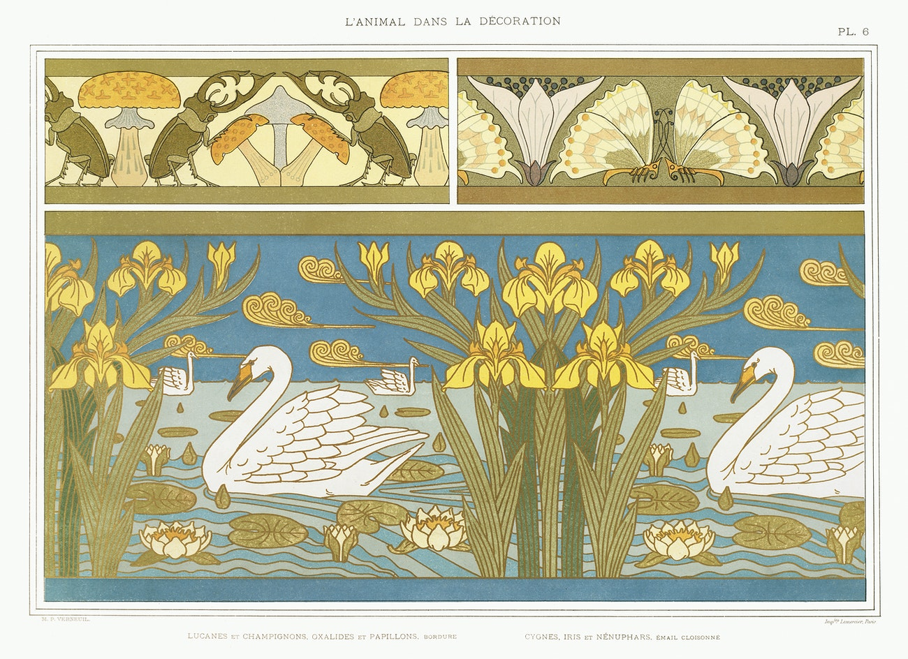
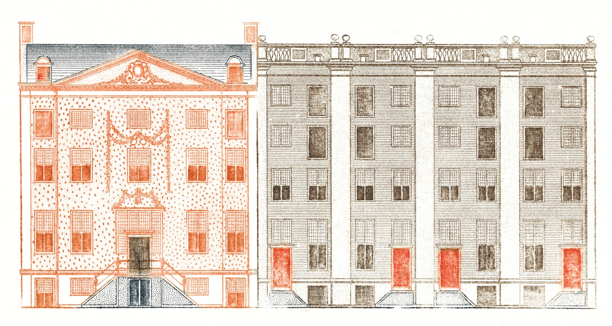
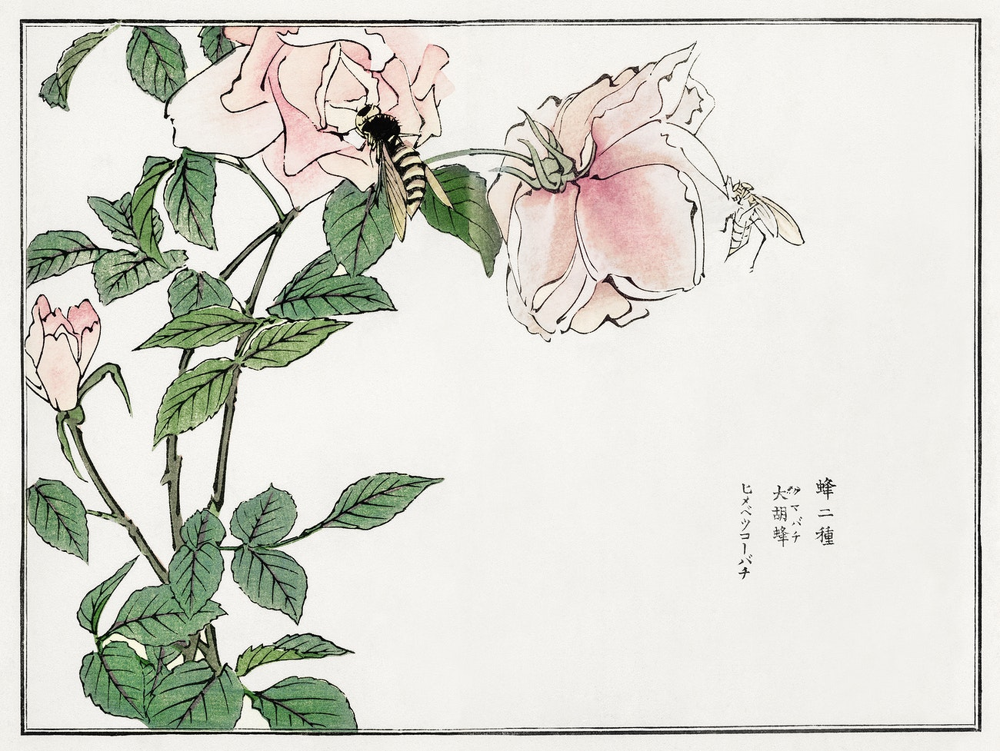
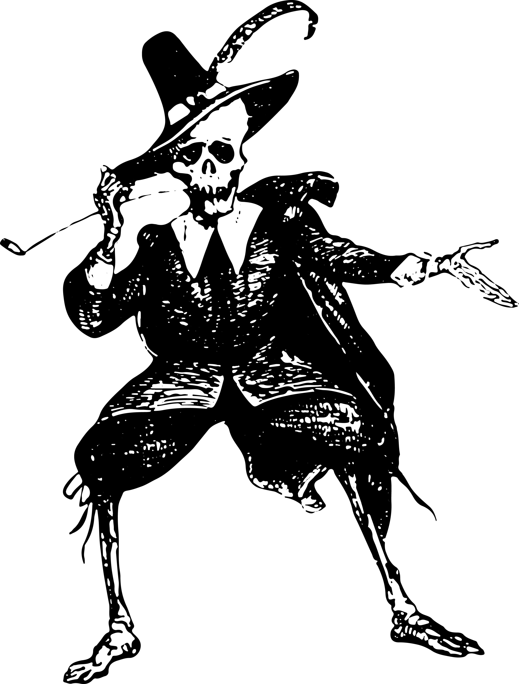
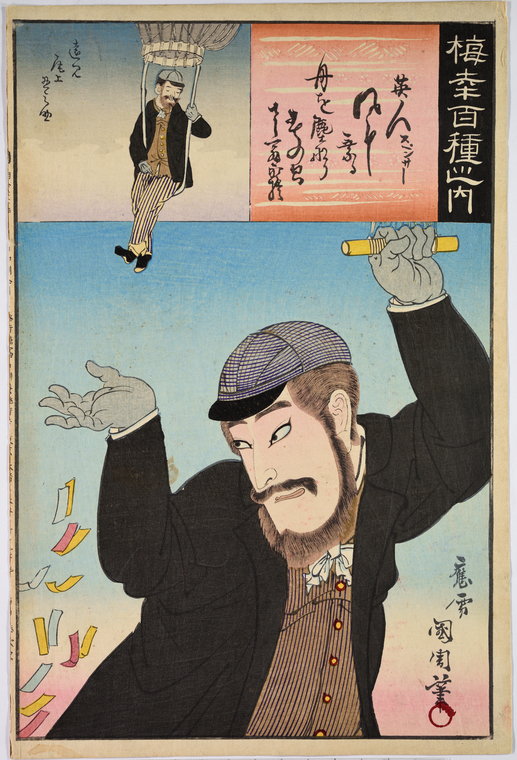
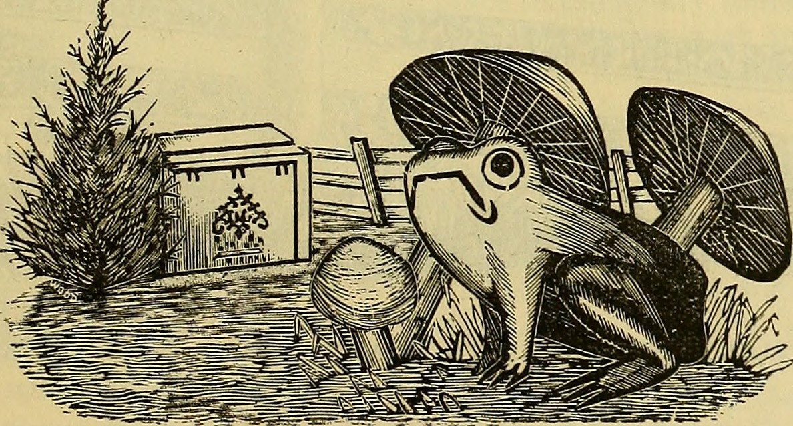

Good art for games can be hard to find. It's great if you can create or commission original art yourself, but sometimes that's not viable. Here's some good sources for free, public domain, out-of-copyright art.

Careful selection, curation and use of public domain art is a skill in itself. You'll often need to adjust, modify or treat the artwork to work for your purposes. Browsing these galleries for the perfect piece for your needs can be overwhelming but rewarding. Take from the past and make it your own!

## Old Book Illustrations

    

    

This collection is fantastic, offering nicely curated galleries with a focus on 19th century book illustrations. The images are high resolution and with original scans so you can clean them up for your own purposes if their approach isn't quite right for what you need.

➔ [Old Book Illustrations](https://www.oldbookillustrations.com/)

## Rawpixel public domain collection

    

    

    

A big collection of extremely high-quality scans of public domain illustrations and artwork. Well curated and a good selection of fine artists, Japanese prints, decorative art and book illustrations. You need to make an account to download high-quality images.

➔ [Rawpixel public domain collection](https://www.rawpixel.com/category/53/public-domain)

## Heritage Library

    

Heritage Type maintains a library of public domain images that while not enormous is well curated and have already been processed for ease of use.

I'm not a huge fan of some of their processing decisions, so they might not work for all situations. Black-and-white illustrations have been vectorised, so they lose some of the detail and life of a raw scan, but at small-size they should work well. The color scans have been separated as transparent images, which will allow for easy use overlaying other parts of layouts.

➔ [Heritage Library](https://www.heritagetype.com/collections/free-vintage-illustrations)

## Galleries and libraries 

    

These collections are huge, but it will typically be difficult to find something that is practical to use and will require additional work to prepare for use in a book or game. On the plus side, their scans are often of fantastic quality, and collections are both large and varied.

If your taste and need leans towards fine art and paintings, rather then illustrations, start with these.

### New York Public Library 

The New York Public Library's collection of 900,000+ images are well curated, and available at absurdly high-quality.  

➔ [New York Public Library digital collections](https://digitalcollections.nypl.org/)  

### The Met Open Access collection

The Met's collection of 400,000+ images is difficult to navigate, but available at 

➔ [The Met Open Access collection](https://www.metmuseum.org/about-the-met/policies-and-documents/open-access)  

### Biodiversity Heritage Library

    

If you're looking for animal art, this is a fantastic place to start, with a wide variety of natural history illustrations. Sadly, many of the scans are not great, available only as low-quality, low-resolution JPEGs. Check out the [Biodiversity Library](https://www.rawpixel.com/board/1318074/biodiversity-public-domain-i-plants-nature-i-free-high-resolution-cc0-images?sort=curated&mode=shop&page=1) album that Rawpixel maintains for a similar collection of images, available at much higher quality.

➔ [Biodiversity Heritage Library](https://www.flickr.com/search/?tags=bookcollectionbiodiversity)  

### The British Library

Strangely, the British Library's public domain collection exists only as a Flickr gallery, making it quite difficult to navigate the million+ images. Images are often sub-par resolution for print.

➔ [The British Library Public Domain collection](https://www.flickr.com/photos/britishlibrary/albums)  

## More sources

This is just a small, curated list of sources for public domain images. There are certainly many more excellent galleries and collections online available for free use.

Got a favorite collection of public domain images that I've missed? [Let me know](https://twitter.com/isaacwilliams)!
